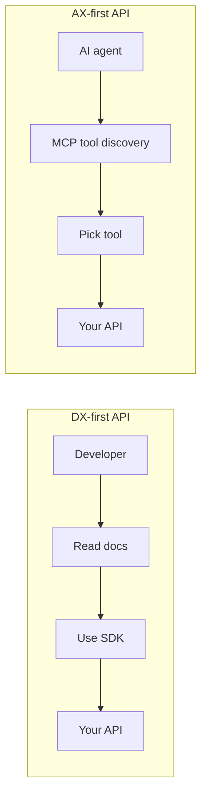

Developer experience has been the north star for API design for something like fifteen years. Readable docs, consistent endpoints, good error messages, delightful SDKs. DX is why Stripe won over older payment APIs. It's why Vercel felt inevitable even when the market was crowded. Tools compete on the developer's experience of using them, and the ones that win the experience usually win the category.

That era is ending. Not because DX stops mattering. Humans still build these systems, and we still have taste. The shift is in who the *primary consumer* of your API is.

Increasingly, the thing calling your API is not a human. It's an agent. Claude with tool use. An autonomous research assistant. A support bot. A coding agent. The agent doesn't read your docs in the way a human reads docs. It doesn't browse your tutorials. It uses whatever you expose at runtime to decide what to do — and if you haven't exposed what it needs, it gets stuck or hallucinates.

**Agent Experience (AX) is DX for this new consumer.**

The teams that start optimizing for AX early are going to feel as inevitable in 2030 as Stripe did in 2015. The teams that don't are going to wonder why their APIs are invisible to the agents their customers are actually using.

## What agents actually need

The requirements are different from human DX, but not unrecognizable. Some of the same principles translate. The ones that matter most:

**Self-describing interfaces.** An agent shouldn't need to read your human-facing docs to use your API. The tool definitions, schemas, parameter descriptions should be machine-readable and embedded in the API surface. The [Model Context Protocol](https://modelcontextprotocol.io/) does this by design: tools carry their own documentation, so an agent that speaks MCP can use any MCP server without prior knowledge.

**Deterministic, structured errors.** Humans can interpret "something went wrong" and try again. Agents need structured errors they can reason about. Error codes, machine-readable categories, and specific guidance ("the `since` parameter must be ISO8601") let an agent correct itself instead of retrying blindly.

**Structured outputs.** Humans parse prose. Agents parse JSON. If your API returns a narrative paragraph, agents have to do text interpretation and they break. If it returns typed data, agents do well. This is obvious in hindsight and surprisingly underrated in practice.

**Small, composable tools.** Humans tend to like big endpoints that do a lot. Agents work better with small tools they compose. The trade: you give up the elegant "do-everything" endpoint, you gain reliability and precision. Agents can explain their reasoning in terms of small tool calls in a way they can't with one opaque meta-call.

**Schema discovery.** Agents shouldn't need the schema handed to them out of band. They should be able to ask your API what's available. This is a shift from the old model where schema lived in docs or in hand-curated SDK types.

## DX vs AX: a concrete comparison

Take a real scenario: "get the orders for a customer."

**DX-optimized endpoint.** Rich docs page explaining the endpoint. REST pattern: `GET /customers/{id}/orders`. JSON response with well-named fields. cURL examples. SDKs in five languages. An API key.

A human developer reads the docs, copies the cURL, tries it, iterates, wires it into their app.

**AX-optimized endpoint.** An MCP tool called `list_customer_orders` with a machine-readable description, typed parameters (customer_id, date_range, limit), a structured result schema. Discoverable at runtime: the agent asks the server "what tools do you have?" and this one shows up.

An agent reads the tool list, picks this tool, fills in the parameters, gets typed data back. No docs read, no SDK configured, no tutorials watched.

Both can coexist. In fact, both *should* coexist. But if your API only has the DX version, the agent consumer is left to scrape the documentation and guess. That mostly works, until it doesn't. An AX version of the same capability is a small amount of extra work that opens the API to a fundamentally different class of consumers.

Visualized side by side:

The paths are different. The end point (calling your API) is the same. But the experience on the way there is tuned for a different kind of consumer, and the consumer matters.

## Why MCP and A2A matter for AX

If DX has REST and OpenAPI as its backbone, AX has [MCP](https://modelcontextprotocol.io/) and [A2A](https://google.github.io/A2A/). These are the protocols that make tool use and agent composition portable. If you're building for agents, adopting them is the difference between being discoverable and being invisible.

MCP is more mature today. A2A is earlier, but the direction is clear enough that starting to think about agent-to-agent composition is reasonable even before your production deployments need it.

The [agentic data layer post](/blog/building-agentic-data-layer-mcp-a2a) goes deeper on the ecosystem implications.

## What good AX looks like in practice

A checklist for the AX of a system you're building or evaluating:

- Tool descriptions are written for machines, not humans. Concise, specific, unambiguous.
- Parameters are typed, with explicit required/optional and validation rules.
- Return shapes are declared, so agents can plan how to use the output.
- Failure modes are enumerated and structured.
- Tools are composable: small, focused, designed to be chained.
- The surface is discoverable: agents can list available tools at runtime.
- Observability is built in: agents can see what happened, what ran, what it cost.

If your system has most of these, agents can use it well. If it doesn't, agents will guess, and they'll get things wrong often enough that your users notice.

## Data access as the test case for AX

Data is where AX matters most, because data access is where agents spend most of their time. Every other capability, eventually, needs to touch data. Poor AX around your data means agents hallucinate, because when they can't reliably retrieve what they need, they make things up to fill the gap.

This is the problem Baseil is built to solve. A data agent designed agent-first: MCP out of the box, A2A incoming, structured outputs, auto-discovery, typed parameters, machine-readable descriptions for every tool. The whole point is to be an easy target for other agents, and that starts with AX.

A data layer with good AX makes every product agent better by reducing the amount of hallucination-space the product agent has to cover on its own.

## Where DX still matters

An honest caveat. DX isn't going away. Humans still design, build, test, debug, and maintain these systems. The allocation is shifting, but it's not flipping overnight.

In 2020, essentially 100% of your API consumers were human. In 2028, maybe 30% still are. The remaining 70% are agents, and most of those agents are being built by humans who also want a good DX. So you end up needing both, first-class.

The practical implication: API design going forward has two user groups with different needs. DX for the humans building and maintaining the systems. AX for the agents they're deploying. Build for both. The systems that do will feel, in retrospect, like they were designed for the future.

## Try it

If you want to see AX-first design in practice, [Baseil's MCP setup](/docs/mcp-setup) is a concrete example. An agent can connect, discover your data, and query it, all without any human-facing setup beyond giving the agent an API key.

Related:

- [Building the Agentic Data Layer](/blog/building-agentic-data-layer-mcp-a2a)
- [Expose Your Database as MCP Tools — No Code Required](/blog/expose-database-as-mcp-no-code)
- [What Is an Intelligent Data Agent?](/blog/what-is-intelligent-data-agent)
