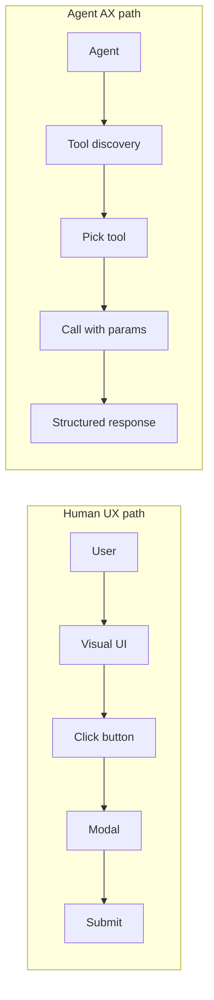

User experience is the discipline of making products that work for the people using them. Clear affordances. Predictable flows. Sensible defaults. Graceful error recovery. A sense of momentum when the user is trying to get something done. UX is what makes a product feel usable instead of just technically functional, and it's the reason teams with great UX talent build things that people come back to.

Here's the shift: the "people using your product" category is quietly getting a new member. AI agents are starting to use products. Not just consume APIs — actually navigate product surfaces, complete tasks, handle errors, read state, and make decisions. A support agent that resolves tickets inside your tool. A shopping agent that buys things on a customer's behalf. A coding agent that deploys to your platform.

Agents are a new user class. And like every new user class before them (keyboard-only users, screen reader users, mobile users, touch-first users), they need something a little different to have a good experience.

**Agent Experience (AX) is UX for agents.**

## Why this is a UX problem, not a DX problem

It's tempting to file agent work under "API design." That's too narrow. A REST endpoint is a surface agents can use, but it's not the whole experience. Real agents move through your product the way a real user does: logging in, reading dashboards, filling forms, recovering from errors, chaining steps together to get a job done.

If you've worked on UX, the parallels should feel familiar:

- **Affordances.** Humans need buttons that look clickable. Agents need tools that are discoverable at runtime and describe what they do.
- **Navigation.** Humans need clear information architecture. Agents need structured schemas and composable tools.
- **Feedback.** Humans need toasts and confirmations. Agents need structured responses that say what changed.
- **Error recovery.** Humans need good error messages with a next action. Agents need typed errors they can reason about and retry correctly.
- **Sensible defaults.** Humans rely on them when they don't care about a field. Agents rely on them when they don't have context for a parameter.

These aren't separate problems. They're the same UX principles, applied to a user who reads typed data instead of rendered pixels.

## What "good AX" looks like, in UX terms

Take a real scenario. A user wants to export a report from your product. With good UX, the human finds the Export button, picks a format, confirms, and a file lands in their inbox. The flow is short. The feedback is clear. If something fails, there's a retry path.

Now imagine an agent trying to do the same thing.

If your product only exposes that flow through a visual UI with click targets and modal dialogs, the agent has to drive a browser, interpret rendered HTML, guess at labels, and hope the modal doesn't move. It'll work on a good day and fail on a bad one. The agent's experience is brittle.

Good AX reframes the same flow for the agent consumer:

- A tool called `export_report` appears in the agent's available tool list.
- The tool has a typed description: "Exports a report in the specified format and delivers it to the configured destination."
- Parameters are declared: `report_id` (required, string), `format` (enum: csv, json, pdf), `destination` (optional, defaults to the user's configured email).
- The response is structured: `{ export_id, status, delivery_eta_seconds }`.
- Errors are typed: `REPORT_NOT_FOUND`, `FORMAT_NOT_SUPPORTED`, `DESTINATION_REJECTED`.

Now the agent has an affordance it can actually use. Same task, different interface, good experience.

## The accessibility analogy

There's a useful parallel worth sitting with. For years, teams have been building products that work for users with screen readers. You do that by adding structured markup, semantic HTML, ARIA labels, focus management, and predictable flows. When you do it well, you don't just serve users with disabilities — you end up with a more robust product that works in edge cases too.

AX is the same kind of investment. The structured tool schemas, typed parameters, and machine-readable descriptions that agents need also happen to make your product easier for humans to reason about. Your API gets clearer. Your errors get more specific. Your flows get more composable.

The accessibility analogy also covers the cost question: "isn't this expensive to do?" It's the same answer. Retrofitted accessibility is expensive. Accessibility built in from the start is barely extra cost and compounds forever. AX works the same way.

Same product, two paths. A team that designs only for the top path and exports an SDK for the bottom one is building half a product.

## What agents actually need from your product

Translating UX principles into AX requirements:

**Discoverability.** Agents need to find the capabilities your product offers without reading a docs site. That's what [MCP](https://modelcontextprotocol.io/) provides: a runtime way for agents to ask "what tools do you have" and get a structured answer. If your product speaks MCP, agents can discover it. If it doesn't, they can't.

**Typed inputs and outputs.** Human forms have validation and pattern hints. Agent tools should have typed parameter schemas, enum values where appropriate, and declared response shapes. No prose where structured data belongs.

**Predictable errors.** Humans read "something went wrong" and try again or give up. Agents read that and hallucinate. Errors need codes, categories, and machine-readable guidance for what to do next.

**Composable primitives.** Good UX often means fewer clicks through big smart buttons. Good AX often means the opposite: smaller tools that agents can chain into patterns the designer didn't anticipate. Agents are better at composition than humans and it's a strength worth leaning into.

**Progressive disclosure.** Humans get overwhelmed by too many options on screen. Agents get overwhelmed by too many tools in their context. Both need the same discipline: surface what's relevant, hide what isn't, let the user drill in when they want to.

**Observability.** Humans check receipts and order history. Agents check logs, execution traces, and audit trails. Same need, different surface.

## Data is where AX matters most

This is the concrete thing most product teams hit first. Every agent, at some point, needs data from your product. Customer data, order data, analytics, content, logs. If your data layer has good AX — agents can discover it, query it, retrieve structured results, handle errors gracefully — every agent that touches your product is better off.

If your data layer has poor AX, agents fall back to scraping, guessing, and hallucinating.

This is the problem [Baseil](/) is built to solve. A data layer with AX baked in: MCP-native, structured outputs, typed parameters, machine-readable descriptions, discoverable tools. The whole point is to be an easy target for any agent that wants to work with your data, which makes any product that uses Baseil easier for agents to work with.

## Where UX still matters

A caveat worth stating clearly. UX for humans isn't going away. The vast majority of product interactions for the next several years are still going to be humans, and humans will still judge your product on the quality of the experience you designed for them.

The shift isn't UX vanishing. It's UX expanding. You had one audience, now you have two. Both deserve a product that works well for them. Teams that start thinking this way early get an advantage, because retrofitting AX onto a UX-only product is the same kind of pain as retrofitting accessibility: possible, but expensive, and you'll always wish you'd done it sooner.

## Try it

If you want to see AX-first design in practice, [Baseil's MCP setup](/docs/mcp-setup) is a concrete example. An agent can connect, discover your data, and start using it without any human setup beyond handing it an API key.

Related:

- [Building the Agentic Data Layer](/blog/building-agentic-data-layer-mcp-a2a)
- [Expose Your Database as MCP Tools — No Code Required](/blog/expose-database-as-mcp-no-code)
- [What Is an Intelligent Data Agent?](/blog/what-is-intelligent-data-agent)
