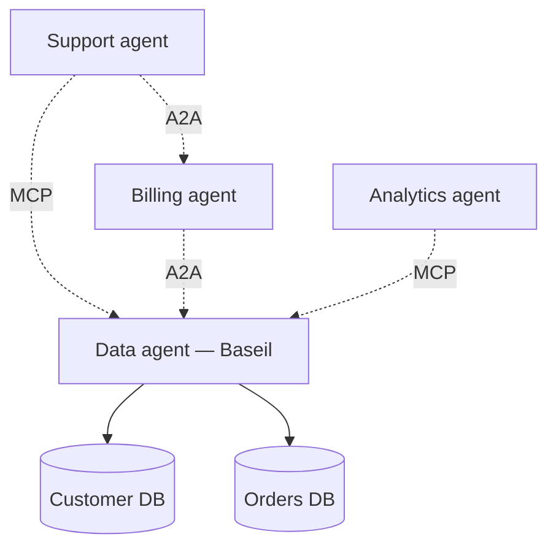

Two protocols are quietly reshaping how AI systems get built. [MCP](https://modelcontextprotocol.io/), the Model Context Protocol, standardizes how agents discover and call tools. [A2A](https://google.github.io/A2A/), Agent-to-Agent, standardizes how agents discover and call each other. They address different problems, but together they point at the same shift: from monolithic assistants that try to do everything, to meshes of specialized agents that compose.

If you squint, this is a repeat of a familiar pattern. The 2000s web went from monolithic apps to services connected by HTTP and JSON. The 2010s went from services to microservices connected by gRPC and protobufs. Every wave ends up looking like small, specialized systems talking through standardized protocols. Agentic systems are in the same arc, just earlier.

The interesting question is: if the future is specialized agents talking to each other, which specializations are worth building first? Our bet is data.

## MCP recap for the uninitiated

If you haven't seen MCP yet, the one-line version: it's a protocol for an agent to discover and use external tools. The agent asks the server "what tools do you have?", the server responds with a machine-readable list including descriptions and argument schemas, and the agent picks a tool and calls it.

The real magic is that this is standardized. Any agent can consume any MCP-compatible tool server without custom integration code. Anthropic [introduced](https://www.anthropic.com/news/model-context-protocol) the protocol in late 2024, and the ecosystem has been growing fast. Claude Desktop, Claude Code, and a lengthening list of other clients speak MCP; servers exist for GitHub, Slack, Postgres, Google Drive, and dozens more.

The one-line takeaway: agents stop needing bespoke integrations per tool. Tools expose themselves via a standard protocol, and any agent speaks it.

## A2A recap

A2A is the same pattern one level up. Agents expose their capabilities, and other agents can discover and invoke them. A "customer support" agent can ask a "billing" agent a question, and the billing agent does whatever it needs to do (including, potentially, calling its own MCP tools) and returns a structured answer.

Google's A2A work is the most visible effort in this space, though the pattern has been converging across the industry. The practical effect: agents stop needing to bundle every capability into one monster. They can delegate to specialists.

## The pattern: specialized agents, standard protocols

Put the two together and the architectural direction becomes clear. The future isn't one agent that does everything. It's a mesh of specialists, each owning a domain, connected by standard protocols.

This has important implications for how you build. Instead of asking "how do I make my one agent smart enough to do customer support and billing and analytics?", you ask "what are the specialist agents I need, and how do they talk to each other?"

Data is the first obvious specialist. Every other agent needs data. Customer support needs to look up orders. Billing needs to pull invoices. Analytics needs to run queries. Marketing needs to segment users. If each of these specialists builds its own shaky database integration, you end up with the same mess you had before, just with more agents.

A data specialist that exposes itself via MCP and A2A becomes a universal dependency:

Every product agent stays focused on its domain. None of them reinvent schema discovery, query generation, safety rails, or audit logging. The data agent does that job, once, for everything.

## Why data needs its own agent

Three reasons the data layer is the right first specialist:

**Scale.** Data access patterns are diverse. Caching, rules, cross-source joins, multi-step query planning. One agent focused here is much better than every product agent reinventing these concerns. The cost-savings alone make the case, but the bigger payoff is quality: a specialist with full attention on data access is better than a generalist with a chapter on it in its prompt.

**Safety.** Data is where damage happens. A dedicated agent enforces read-only, parameter validation, audit logging, rate limiting. Generalist agents handle these things poorly, because they're always playing tug-of-war with whatever other responsibility they're trying to serve. An agent with nothing to do but worry about data safety is better at it, every time.

**Learning.** Data access improves with use. Schema knowledge, feedback, rules, golden cache entries — all of it compounds. A specialist accumulates this. Generalist agents lose it on every reset, because their context windows are packed with other concerns. The data agent you've been using for six months is meaningfully better than the one you installed; a generalist is roughly the same.

## What an agentic data layer looks like in practice

A concrete scenario, so you can picture the flow.

A customer support agent receives a ticket: "I was charged twice last month and I want a refund." The agent needs to understand the customer's recent orders, the charge history, the refund eligibility rules.

Old architecture, without a data specialist: the support agent has to have database connections built in, know which tables to hit, handle SQL injection, manage connection pooling, and implement its own audit log. Each new data source is new integration code.

New architecture, with a data agent: the support agent calls the data agent via A2A. "What are the recent orders and charges for customer X?" The data agent hits Postgres (orders), the billing system (charges), merges the results, returns a structured summary. Support agent doesn't know or care how the query ran.

Zoom in on the responsibilities:

- **Support agent:** Understands the ticket. Decides what data it needs. Frames a follow-up question for the user. Calls the right tools.
- **Data agent:** Understands data access. Answers data questions. Doesn't know or care what the support agent is trying to accomplish.

Clean separation of concerns. The support agent's prompt can be about customer service, not about SQL. The data agent's prompt can be about query planning, not about ticket workflows. Both are better than a monolith that tries to do both.

## Building vs buying

If you're building AI-powered features today, you have a choice: build the data layer yourself, or adopt a purpose-built agentic data layer.

Building yourself is fine if you have exactly one data source, a small schema, a single agent consumer, and no plans to grow. The math is simple: a few weeks of focused work gets you a good-enough layer. You maintain it. It works.

Past that baseline, the math gets rough. Every new data source is another integration. Every new agent is another consumer. Every schema change is coordinated effort across all consumers. Every new class of question is another tool to build.

Adopting a purpose-built layer (Baseil or anything else with this shape) collapses the maintenance to zero for most of those dimensions. New data source? Plug it in, onboarding runs. New agent? Give it an API key, it's live via MCP. Schema changes? Re-onboard, tools update. New question classes? The toolkit already covers them, or you author a rule.

This isn't a hard sell because both options are valid, but the break-even is earlier than most teams think. If you're planning to have more than one AI-powered feature, probably build on a data layer. If you're sure you won't, fine, roll your own.

## Where Baseil fits

We built Baseil to be this layer. MCP support is in production. A2A is in active development (we're saying "soon" for a reason — we want to ship something that actually works, not a marketing claim). The pattern matters whether you use us or not. If you use something else, make sure it checks the boxes: schema-aware, tool-selecting, self-learning, protocol-portable, secure by default.

If you want to see the pattern in operation, [try Baseil locally](/docs/quickstart). A connected database, a chat that answers questions about it, and MCP tools a Claude Desktop client can pick up. It takes five minutes.

## Try it

The [quickstart](/docs/quickstart) is the fastest path. If you want to read more on the broader frame:

- [Why Agent Experience Is the New Developer Experience](/blog/agent-experience-ax-new-developer-experience)
- [The Data Harness Your AI Stack Is Missing](/blog/data-harness-missing-from-ai-stack)
- [Inside Baseil's 5-Agent Pipeline](/blog/inside-baseil-5-agent-pipeline)
