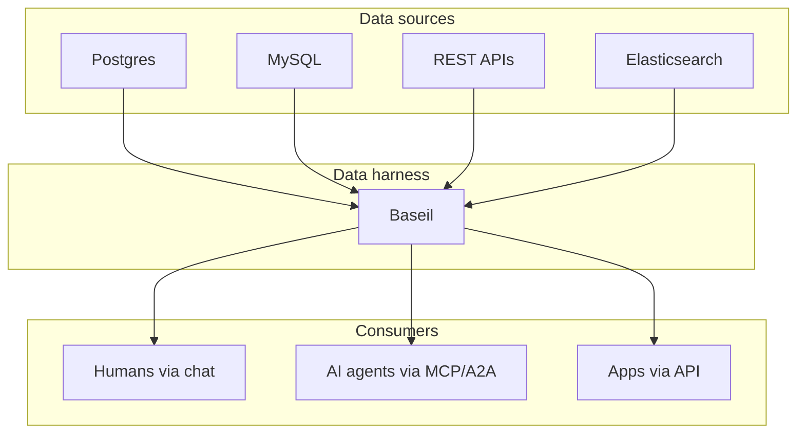

Picture the scene. A customer support agent has a question, and the answer is buried in three databases: the customer record is in Postgres, the subscription is in a billing system you access via REST, and the recent support history is in Elasticsearch. The agent needs to stitch this together to respond to one ticket.

Today, the usual answer is integration. You write a glue service. You build one for billing, one for customers, one for search. You call them from the agent, merge the results, pray nothing changes. Six months later every integration has its own quirks, its own retries, its own schema drift, and nobody remembers why the customer ID field is named differently in three of them.

There's a pattern hiding in this mess that doesn't have a widely-used name yet. We've been calling it a **data harness**.

## What a data harness is

A data harness is an intelligent layer between your data sources and everything that consumes them. It understands schemas. It generates query patterns on demand. It optimizes retrieval. It speaks every protocol your consumers care about, from chat for humans to [MCP](https://modelcontextprotocol.io/) for agents to a plain REST API for apps that want it.

The distinguishing trait is intelligence. Not "connects to things" intelligence. Actual reasoning about what's being asked and how to get it.

Here's how it slots in:

A data harness isn't a connector, which moves bytes but doesn't reason about them. It isn't ETL, which runs on a schedule and produces stale snapshots. It isn't a RAG pipeline, which is good at unstructured text but weak at structured answers. And it isn't a BI tool, which is optimized for humans staring at dashboards. It sits where those categories converge, doing the thing none of them do: serve structured data, intelligently, to anyone who asks.

## Why this matters now

The rise of AI agents creates a pattern nobody planned for. Every agent needs data. Every agent built in the old way comes with its own shaky integration. Teams don't want to maintain N agents times M data sources worth of plumbing, but that's where most of them end up without noticing.

The industry is starting to agree on what the solution looks like at the interface layer. [Anthropic's MCP announcement](https://www.anthropic.com/news/model-context-protocol) is the clearest signal: a standard protocol for tool discovery and invocation, so every agent can talk to every tool without bespoke integration. Google's A2A work extends the same idea to agent-to-agent communication.

But protocols are the interface, not the substance. A protocol tells you how to call a tool. It doesn't tell you how to build the tool. For data, the tool is the hard part: knowing the schema, picking the right query, joining across sources, caching results, enforcing safety. That's what a data harness handles.

## What makes a data harness intelligent

Not every middleware claims intelligence. The ones that earn the word share a few traits:

- **Auto-discovery.** When you point it at a database, it reads the schema, infers relationships, samples data. You don't configure tables by hand. The cost of adding a source is near zero.
- **Tool generation.** Instead of making you write query endpoints, it produces parameterized query templates automatically. These are the tools your consumers actually call.
- **Self-learning.** Common patterns get cached. Feedback (thumbs up/down, rule authoring) shapes future behavior. A harness you've used for six months is smarter than one you just installed.
- **Protocol-agnostic.** Same data, exposed as REST, as MCP tools, as a chat surface, as a stream. Consumers pick the protocol; the harness speaks it.
- **Secure by design.** Read-only by default. Injection-safe. Full audit log. The scary parts of data access are handled once, centrally.

This combination is what separates a data harness from the dozen adjacent categories that touch some of the same territory.

## What this looks like with Baseil

Baseil is our take on the pattern. You connect a Postgres, wait around 30 seconds for the onboarding pipeline to finish, and suddenly Claude (or any MCP-compatible agent) can answer questions about your data. No code written, no tool definitions authored, no schema manually mapped.

The pitch sounds small. The implications aren't. Every new agent on your team can now query your data through a protocol they already speak, with safety and observability baked in.

If you want to see this for yourself, the [quickstart](/docs/quickstart) is about five minutes of real work.

## The stack is consolidating

A prediction, with appropriate caveats. In two years, the current mess of connectors, RAG pipelines, and BI-as-data-layer workarounds will consolidate into something that looks a lot like the data harness pattern. Teams that adopt this early get compounding leverage: every new data source plugs in once and serves every consumer, and every new agent or app plugs in once and reaches every data source.

Whether Baseil is the layer you pick or not, notice the shape. If you're building AI features today and you don't have something in this position, you're either going to build one or feel the absence of one.

## Try it

If the shape resonates, the fastest way to see the difference is to [try Baseil locally](/docs/quickstart). If you want to think more about the layer itself, keep reading:

- [Intelligent Data Retrieval: What It Means When Your Data Layer Has Its Own AI](/blog/intelligent-data-retrieval)
- [What Is an Intelligent Data Agent?](/blog/what-is-intelligent-data-agent)

Or join the waitlist at the bottom of the [homepage](/) and we'll let you know as new connectors and capabilities land.
