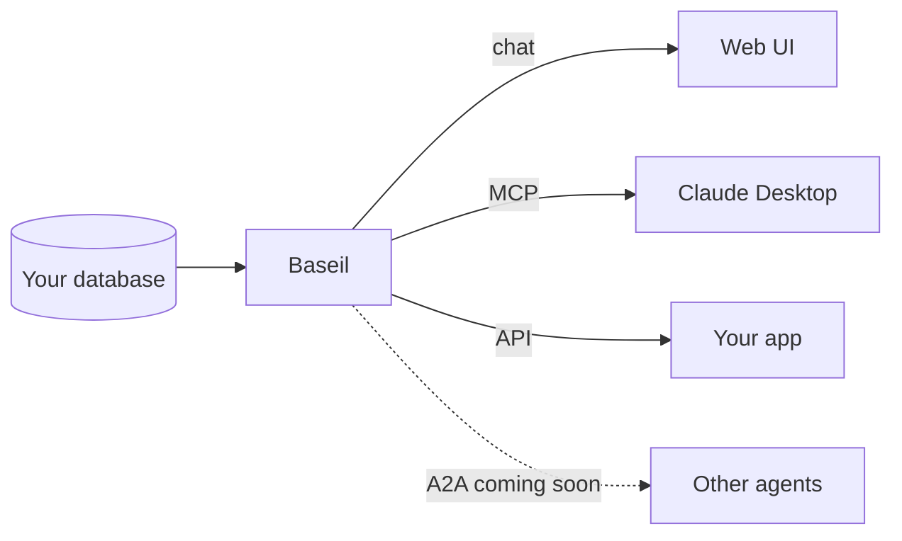

An **agentic backend** is a data layer designed to be consumed by agents. The protocols are already in place ([MCP](https://modelcontextprotocol.io/) for tool use, A2A for agent-to-agent), the tools are discoverable, the safety rails are built in. You don't wrap a REST API in duct tape and call it a day. You stand up something agents can reason against and extend.

This post is the actual 5-minute walkthrough. Not a slide deck, not a high-level architecture diagram. Commands, expected outputs, and what you end up with.

## The 5 minutes

### Minute 1: Install

```bash
curl -sSL https://releases.baseil.ai/install.sh | bash
baseil setup
```

The install script drops the `baseil` binary into your path. `baseil setup` runs a wizard that provisions the local Postgres metadata store, admin credentials, Clerk auth, LLM keys, and embedding model. It takes a few minutes the first time and about 30 seconds if you use defaults.

Start the server:

```bash
baseil start
```

You're now running at `http://localhost:8451`.

### Minute 2: Connect your database

Two ways. In the web UI, go to Connections → Add Connection and fill in the form. From the CLI:

```bash
baseil connections add \
  --name prod \
  --type postgresql \
  --host db.example.com \
  --port 5432 \
  --database app \
  --username readonly_user
```

The read-only user is the important part. Baseil enforces read-only at the SQL level too, but you want defense in depth.

### Minute 3: Watch onboarding

Click Onboard. The 5-agent pipeline runs: Discovery reads your schema and relationships, ToolBuilder generates parameterized query templates, Reviewer does a security audit, Tester runs the tools against your real database with safe params, Deploy registers everything. For a typical schema, this takes 30-60 seconds.

If you want the deep dive on what each agent does, [Inside Baseil's 5-Agent Pipeline](/blog/inside-baseil-5-agent-pipeline) breaks it down.

### Minute 4: Generate an API key, drop it into Claude Desktop

Settings → API Keys → Create key. Copy the key.

Into Claude Desktop's MCP config:

```json
{
  "mcpServers": {
    "baseil": {
      "url": "http://localhost:8451/api/v1/mcp/sse",
      "headers": { "Authorization": "Bearer YOUR_API_KEY" }
    }
  }
}
```

Restart Claude. The Baseil tools appear in the tool list automatically. Full details in the [MCP setup guide](/docs/mcp-setup).

### Minute 5: Ask Claude a question about your data

Start a new conversation and ask something concrete. "How many users signed up in the last 30 days?" Claude calls `baseil__query`, Baseil routes to the right tool, runs the SQL against your Postgres, returns structured results. Claude summarizes. You see the tool call in the UI, so you can verify the number is real.

That's it. Five minutes, more or less.

## What you have now

Let me spell it out, because the implications are easy to miss:

- **Natural-language query access** through the web UI chat and the API.
- **MCP tool access** for any MCP-compatible client. Claude Desktop today, lots more coming.
- **A full query audit log** in the Activities panel. Every tool call, every parameter, every row count.
- **Rules and a golden cache** for shaping future behavior and getting instant answers to repeated questions.
- **Cross-database joins** if you connect more than one source. Baseil plans the join for you.

Visualized, what you just built:



A2A is in active development. The solid arrows work today. The dashed one is the direction we're heading.

For a broader take on where this is going, see [Building the Agentic Data Layer](/blog/building-agentic-data-layer-mcp-a2a).

## What an agentic backend isn't

An honest caveat. An agentic backend isn't just "a REST API with chat completion bolted on." It's not a RAG pipeline that returns text chunks. It's a purpose-built layer where tools, reasoning, and feedback are first-class.

If your system runs SQL when asked and stops there, it's not an agentic backend. It's a question answerer. The difference shows up when you add the second agent, the third agent, the first rule, the first cached query. An agentic backend gets better under load. A question answerer stays the same.

## Try it

[Quickstart is here](/docs/quickstart). Five minutes of your time.

Related:

- [What Is an Intelligent Data Agent?](/blog/what-is-intelligent-data-agent)
- [Expose Your Database as MCP Tools](/blog/expose-database-as-mcp-no-code)
- [Why Agent Experience Is the New Developer Experience](/blog/agent-experience-ax-new-developer-experience)
