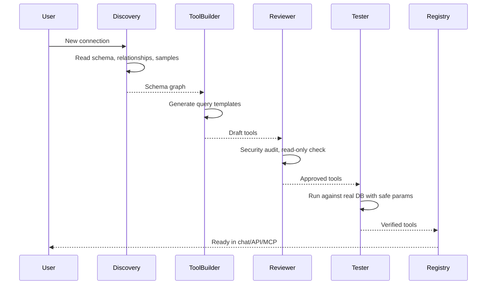

Most text-to-SQL tools are a single-shot call: you pass a question and a schema into a language model, it emits SQL, you run it. This shape is easy to build and easy to demo. It also breaks in a predictable set of ways: wrong tables, silent errors, injection risks, no audit trail, no capacity to learn from what went wrong. If you want a system robust enough to put in front of other agents, or to hand to your data team as something they can trust, the single-shot architecture is the wrong starting point.

Baseil is built differently. Database onboarding is a pipeline of five specialized agents. Each has a single job. Each is built to be reliable at that job, at the cost of being useless at any other. The pipeline runs once per database connection and produces a set of production-grade query tools that every downstream consumer (chat, MCP, API) uses.

This post walks through each stage: what it does, why it exists, and what we learned building it.

## The big picture

Before zooming in, here's how the agents interact:

The arrows are strict: each stage runs to completion, hands off structured output to the next stage, and never loops back. This makes the pipeline debuggable (every stage has known input and output) and rerunnable (rerunning one stage doesn't require re-running upstream).

We'll go through each agent in order.

## Agent 1: Discovery

**What it does.**

- Connects to the target database using the provided credentials.
- Extracts table names, column names, data types, nullability.
- Reads foreign keys and inferred relationships (including relationships that aren't FK-declared but are implied by naming patterns).
- Samples data (default 5 rows per table, configurable).
- Detects schema drift on re-runs, producing a diff against the previous schema graph.

**Design notes.**

Discovery lives in its own agent for three reasons. First, separation of concerns: schema reading is mostly deterministic and mostly independent of the LLM, so it benefits from being a narrow, well-tested component. Second, rerunnability: when schemas change, you want to rerun discovery in isolation without invalidating the entire pipeline. Third, schema drift tracking is a first-class operation we exposed as its own feature, and having it share infrastructure with onboarding keeps the logic consistent.

The "agent" framing might be slightly generous for Discovery. Most of the heavy lifting is database-specific SQL (`information_schema` queries for Postgres, `INFORMATION_SCHEMA` for MySQL, Elasticsearch's mapping API for ES). The LLM role is smaller: it annotates inferred relationships, suggests semantic groupings, and flags unusual patterns for the next stage. But the framing matters because it keeps the same interface as the other agents — structured input, structured output, tool-use for the parts that need it.

## Agent 2: Tool Builder

**What it does.**

- Reads the schema graph from Discovery.
- Generates parameterized query templates that cover the common question patterns.
- Writes natural-language descriptions and example queries for each tool.
- Parameterizes inputs: types, required fields, validation rules, sensible defaults.

**Design notes.**

Two decisions here shaped everything downstream.

**Sparse tools beat dense tools.** The naive approach generates one tool per table per operation: `list_orders`, `count_orders`, `find_order_by_id`, and so on for every table. You end up with hundreds of tools, which is hard to maintain, hard to reason about, and hard for the language model to select from at query time.

The better approach is sparse: a smaller number of highly parameterized templates that generalize across tables. `list_entities_with_filters` takes a table name, a set of filter conditions, a sort, and a limit. `aggregate_over_dimension` takes a table, a group-by column, an aggregation function, and a set of filters. Ten tools of this shape cover thousands of variant queries.

Sparse tools require more sophisticated parameter handling, but the trade is worth it. Maintenance scales with the number of query patterns, not the number of tables.

**Template-driven SQL beats free-form.** Even with good sparse tools, the temptation is to have the LLM write SQL on the fly. Don't. Use templates where the SQL skeleton is fixed and only the parameters vary. This gives you predictability, injection safety, auditability, and testability. The LLM's job is to pick the template and fill the parameters — not to write SQL from scratch.

In concrete terms: a tool like `list_customers_with_filters` has a fixed SQL skeleton that accepts a list of (column, operator, value) tuples for filtering, a list of sort columns, and a limit. The skeleton lives in code. The LLM chooses the parameters. Injection attacks have no surface because user input never touches the SQL string directly; it only binds to parameters.

## Agent 3: Reviewer

**What it does.**

- Static analysis of each tool's SQL for injection patterns, unparameterized concatenation, or dangerous constructs (dynamic table references, unescaped identifiers, etc.).
- Confirms read-only enforcement: no `INSERT`, `UPDATE`, `DELETE`, `DROP`, etc. unless explicitly authorized.
- Checks parameter handling for type safety and validation.
- Flags anything that can't be validated automatically.

**Design notes.**

A specialized security agent is better than a general agent with "also, do security" instructions. The scope is narrow enough to be testable, the output is a clear pass/fail per tool, and when a change slips through, we can trace it to Reviewer logic specifically.

There's a temptation to fold Reviewer into Tool Builder ("just have the builder write safe code"). We tried. It's worse. The prompts for "generate the best tool you can" and "find every possible security issue" pull in different directions. Separating them into two agents with distinct objectives produces cleaner behavior from both.

The other nice property: Reviewer is the easiest agent to upgrade independently. When we find a new class of issue, we update Reviewer's rules. The other agents don't change.

## Agent 4: Tester

**What it does.**

- Runs each approved tool against the real database with safe sample parameters derived from the schema.
- Verifies that queries execute, return the expected shape, and complete within a reasonable time budget.
- Records failures with structured error info that goes back to the user.

**Design notes.**

Tests run against the real database, not a mock. This is the right call even though it's slower. Real schemas have weird corners: a column that claims to be NOT NULL but has NULLs in practice, a FK that looks valid but points to rows that no longer exist, a data type that's technically compatible but actually rejects certain inputs. These problems don't show up in mocks. They show up when you run the query for real, and you want to find them during onboarding, not at query time with a real user waiting.

Sample parameters are derived from the data Discovery collected. If `orders.status` has values like `"pending"` and `"shipped"` in the sample rows, Tester uses those as the filter values. This keeps tests realistic without having the human construct test cases.

One safety note worth calling out: Tester runs read-only by default, but we still scope every test to a safe row count limit. Even a read query can DoS a database if it returns the whole table and the table has a billion rows. Tests are bounded.

## Agent 5: Deploy

**What it does.**

- Registers approved and tested tools in the tool registry.
- Makes them available immediately to chat, API, and MCP.
- Versions the toolset so you can roll back.

**Design notes.**

Deploy is small. Deliberately. The pipeline's value is in the upstream agents; deploy just makes the output available. Keeping it thin means tools go live fast and rollback is cheap.

Versioning matters more than it sounds. When a new onboarding run produces tool definitions, the previous version is retained. If the new tools cause issues downstream (e.g., the LLM starts picking the wrong tool for some class of question), we can pin the registry back to the previous version without losing state.

## The feedback loop

After deployment, the pipeline isn't finished. Every tool call generates a log entry. Every user thumbs-up or thumbs-down feeds into a signal that informs future tool selection. Pinned queries populate the golden cache for instant reuse. Rules authored by users shape retrieval.

All of this flows back into the tool registry's metadata. A tool with consistent positive feedback gets slight priority when the chat is picking among candidates. A tool that's been negatively flagged for a specific question class gets deprioritized for similar questions. The effect is subtle but cumulative: the system gets measurably better over weeks of use, without manual retraining or prompt tuning.

This feedback loop is a fifth-and-a-half agent, in a sense. It doesn't run as part of onboarding, but it runs continuously on query traffic, and its outputs are what keep the pipeline's outputs sharp.

## Why this decomposition works

A monolithic agent that "handles everything" is tempting because it's conceptually simple. It's also worse at every individual task, harder to debug when something goes wrong, and harder to improve because every change is a change to the same big prompt.

The five-agent decomposition has the opposite properties. Each agent is small. Its inputs and outputs are specified. It can be tested in isolation. It can fail loudly at its boundaries, which makes the failure mode obvious instead of mysterious. And because each agent is narrow, improvements to any one of them don't risk regressing the others.

The cost is complexity: there are more moving parts, the interfaces between stages are extra code, and you have to keep schemas synchronized across the boundaries. For the problem we're solving (turning a raw database into a production-grade data agent in under a minute), that cost is worth paying many times over.

If you're designing an agentic system and you're staring at a monolithic prompt trying to do three unrelated jobs, consider splitting it. Smaller agents, clear interfaces, explicit pipelines. It's rarely a wrong move.

## Try it

If you want to see the pipeline in action, [the quickstart](/docs/quickstart) walks you through running it against a real database.

Related:

- [Building the Agentic Data Layer](/blog/building-agentic-data-layer-mcp-a2a)
- [Why Agent Experience Is the New Developer Experience](/blog/agent-experience-ax-new-developer-experience)
- [What Is an Intelligent Data Agent?](/blog/what-is-intelligent-data-agent)
