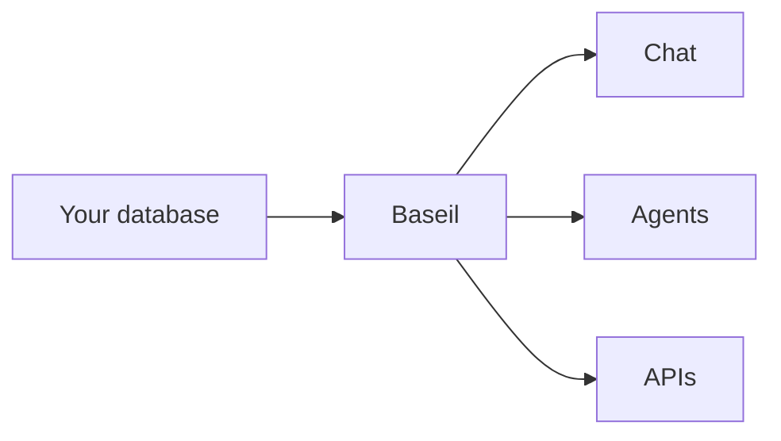

# Plan B — Content Infrastructure + Content Program

> **For agentic workers:** REQUIRED SUB-SKILL: Use superpowers:subagent-driven-development (recommended) or superpowers:executing-plans to implement this plan task-by-task. Steps use checkbox (`- [ ]`) syntax for tracking.

**Goal:** Ship the full content program — 4 docs pages and 9 blog posts — plus the infrastructure they need: Mermaid diagram support, a docs route with sidebar navigation, and any blog framework extensions needed for the new posts.

**Architecture:** Reuse the existing blog framework (`src/lib/blog.ts`, `src/components/blog/MarkdownRenderer.tsx`). Extend with Mermaid support via a dynamic import in a client component. Mirror the blog pattern for docs (`src/lib/docs.ts`, `src/app/docs/[slug]/page.tsx`). Docs use an `order` field instead of date sorting and include a sidebar navigation component.

**Tech Stack:** Next.js 16, React 19, TypeScript 5, react-markdown, remark-gfm, gray-matter (all already installed). New dependency: `mermaid`.

**Branch:** `website-revamp-2026-04` (already created).

**Writing style for all content:**
- Natural, casual, human voice. Varied sentence length.
- Technical terminology used accurately, not as jargon wall.
- Avoid em-dash overuse. Use commas, parentheses, sentence breaks.
- Link to authoritative external sources where useful (MCP spec, A2A docs, real tools mentioned).
- No AI-tell phrases like "dive into", "game-changer", "unleash the power of".
- Each post ends with a clear CTA (try Baseil, join waitlist, or a related post link).

**Verification approach:** Same as Plan A. `npx tsc --noEmit`, `npm run lint`, `npm run build`, manual browser check.

---

## File Structure

**Files Created:**
- `src/components/blog/MermaidDiagram.tsx` — client-only component that renders a Mermaid diagram from source
- `src/lib/mermaid-theme.ts` — shared Mermaid theme config matching Baseil design
- `src/lib/docs.ts` — docs markdown reader (mirrors blog.ts pattern)
- `src/components/docs/DocsSidebar.tsx` — sidebar navigation listing all docs by order
- `src/app/docs/[slug]/page.tsx` — individual docs page route
- `content/docs/quickstart.md`
- `content/docs/connecting-databases.md`
- `content/docs/chat-interface.md`
- `content/docs/mcp-setup.md`
- `content/blog/data-harness-missing-from-ai-stack.md`
- `content/blog/intelligent-data-retrieval.md`
- `content/blog/expose-database-as-mcp-no-code.md`
- `content/blog/ask-your-database-without-sql.md`
- `content/blog/what-is-intelligent-data-agent.md`
- `content/blog/database-to-agentic-backend-5-minutes.md`
- `content/blog/inside-baseil-5-agent-pipeline.md`
- `content/blog/building-agentic-data-layer-mcp-a2a.md`
- `content/blog/agent-experience-ax-new-developer-experience.md`

**Files Modified:**
- `src/components/blog/MarkdownRenderer.tsx` — add Mermaid code block handling
- `src/app/docs/page.tsx` — replace placeholder with docs listing page
- `package.json` / `package-lock.json` — add `mermaid` dependency

---

## Task 1: Install Mermaid

**Files:**
- Modify: `package.json`, `package-lock.json`

- [ ] **Step 1: Install mermaid**

Run: `npm install mermaid`
Expected: Package installs successfully.

- [ ] **Step 2: Verify**

Run: `grep '"mermaid"' package.json`
Expected: Line like `"mermaid": "^11.x.x"` in dependencies.

- [ ] **Step 3: Commit**

```bash
git add package.json package-lock.json
git commit -m "chore: add mermaid for blog diagram rendering"
```

---

## Task 2: Create Mermaid theme config

Shared theme so all Mermaid diagrams across the blog inherit Baseil colors.

**Files:**
- Create: `src/lib/mermaid-theme.ts`

- [ ] **Step 1: Write the theme config**

File: `src/lib/mermaid-theme.ts`

```ts
import type { MermaidConfig } from 'mermaid'

export const baseilMermaidConfig: MermaidConfig = {
  startOnLoad: false,
  theme: 'base',
  fontFamily: 'var(--font-outfit), system-ui, sans-serif',
  themeVariables: {
    background: '#0A0F0D',
    primaryColor: '#111916',
    primaryTextColor: '#C8D8C4',
    primaryBorderColor: '#52B788',
    lineColor: '#52B788',
    secondaryColor: '#1A2520',
    secondaryTextColor: '#8FAF8A',
    secondaryBorderColor: '#52B788',
    tertiaryColor: '#0D1410',
    tertiaryTextColor: '#8FAF8A',
    tertiaryBorderColor: '#52B788',
    noteBkgColor: '#111916',
    noteTextColor: '#C8D8C4',
    noteBorderColor: '#52B788',
    edgeLabelBackground: '#0A0F0D',
    clusterBkg: 'rgba(82, 183, 136, 0.04)',
    clusterBorder: 'rgba(82, 183, 136, 0.2)',
    // Sequence diagram specifics
    actorBkg: '#111916',
    actorBorder: '#52B788',
    actorTextColor: '#C8D8C4',
    actorLineColor: '#52B788',
    signalColor: '#8FAF8A',
    signalTextColor: '#C8D8C4',
    labelBoxBkgColor: '#111916',
    labelBoxBorderColor: '#52B788',
    labelTextColor: '#C8D8C4',
    activationBkgColor: 'rgba(82, 183, 136, 0.15)',
    activationBorderColor: '#52B788',
  },
  flowchart: {
    curve: 'basis',
    padding: 20,
    nodeSpacing: 50,
    rankSpacing: 60,
  },
  sequence: {
    diagramMarginX: 40,
    diagramMarginY: 20,
    actorMargin: 60,
    width: 160,
    height: 50,
    boxMargin: 10,
    boxTextMargin: 5,
    noteMargin: 10,
    messageMargin: 40,
  },
}
```

- [ ] **Step 2: Verify type check passes**

Run: `npx tsc --noEmit`
Expected: No errors.

- [ ] **Step 3: Commit**

```bash
git add src/lib/mermaid-theme.ts
git commit -m "feat(blog): add shared Mermaid theme matching Baseil design"
```

---

## Task 3: Create MermaidDiagram component

Client-only component that lazily loads Mermaid and renders a diagram.

**Files:**
- Create: `src/components/blog/MermaidDiagram.tsx`

- [ ] **Step 1: Write the component**

File: `src/components/blog/MermaidDiagram.tsx`

```tsx
'use client'

import { useEffect, useRef, useState } from 'react'
import { baseilMermaidConfig } from '@/lib/mermaid-theme'

let mermaidPromise: Promise<typeof import('mermaid').default> | null = null
function loadMermaid() {
  if (!mermaidPromise) {
    mermaidPromise = import('mermaid').then(mod => {
      mod.default.initialize(baseilMermaidConfig)
      return mod.default
    })
  }
  return mermaidPromise
}

let counter = 0

export function MermaidDiagram({ source }: { source: string }) {
  const ref = useRef<HTMLDivElement>(null)
  const [error, setError] = useState<string | null>(null)
  const idRef = useRef(`baseil-mermaid-${++counter}`)

  useEffect(() => {
    let cancelled = false
    loadMermaid()
      .then(mermaid => mermaid.render(idRef.current, source))
      .then(({ svg }) => {
        if (cancelled) return
        if (ref.current) ref.current.innerHTML = svg
      })
      .catch(err => {
        if (cancelled) return
        setError(err instanceof Error ? err.message : String(err))
      })
    return () => { cancelled = true }
  }, [source])

  if (error) {
    return (
      <div className="my-6 p-4 rounded-xl border border-red-500/20 bg-red-500/[0.04] font-[var(--font-outfit)] text-[0.85rem] text-red-300">
        Diagram failed to render: {error}
      </div>
    )
  }

  return (
    <div
      ref={ref}
      className="my-6 p-6 rounded-xl border border-[#52B788]/[0.08] bg-[#0D1410]/60 overflow-x-auto flex justify-center"
    />
  )
}
```

- [ ] **Step 2: Verify type check passes**

Run: `npx tsc --noEmit`
Expected: No errors.

- [ ] **Step 3: Commit**

```bash
git add src/components/blog/MermaidDiagram.tsx
git commit -m "feat(blog): add MermaidDiagram component with lazy mermaid loading"
```

---

## Task 4: Wire Mermaid into MarkdownRenderer

Detect ` ```mermaid` code blocks and render them as `<MermaidDiagram>` instead of as plain `<pre><code>`.

**Files:**
- Modify: `src/components/blog/MarkdownRenderer.tsx`

- [ ] **Step 1: Import MermaidDiagram**

At the top of `src/components/blog/MarkdownRenderer.tsx`, add:

```tsx
import { MermaidDiagram } from './MermaidDiagram'
```

- [ ] **Step 2: Replace the code handler with a Mermaid-aware version**

Find the existing `code` handler (around lines 66-80). Replace the whole handler with:

```tsx
code: ({ className, children, ...props }) => {
  const isInline = !className
  if (isInline) {
    return (
      <code className="font-mono text-[0.85em] text-[#6FCF97] bg-[#52B788]/[0.08] px-1.5 py-0.5 rounded-md border border-[#52B788]/[0.08]">
        {children}
      </code>
    )
  }
  if (className === 'language-mermaid') {
    const source = String(children).replace(/\n$/, '')
    return <MermaidDiagram source={source} />
  }
  return (
    <code className={`${className} block`} {...props}>
      {children}
    </code>
  )
},
```

- [ ] **Step 3: Ensure the pre handler doesn't wrap Mermaid output**

The existing `pre` handler wraps any `<code>` in `<pre>`. For Mermaid, `MermaidDiagram` is rendered instead of a `<code>` element, so React-markdown will still call the `pre` handler with `MermaidDiagram` as child.

Find the existing `pre` handler (around lines 81-85). Replace with:

```tsx
pre: ({ children }) => {
  // If the child is a MermaidDiagram (detected via displayName or by checking if it's not a code element),
  // render it without the <pre> wrapper.
  const firstChild = Array.isArray(children) ? children[0] : children
  if (firstChild && typeof firstChild === 'object' && 'type' in (firstChild as object)) {
    const type = (firstChild as { type?: unknown }).type
    if (type === MermaidDiagram) {
      return <>{children}</>
    }
  }
  return (
    <pre className="bg-[#0D1410] border border-[#52B788]/[0.08] rounded-xl p-5 mb-6 overflow-x-auto text-[0.84rem] leading-[1.7] font-mono text-[#8FAF8A] scrollbar-thin">
      {children}
    </pre>
  )
},
```

- [ ] **Step 4: Verify type check passes**

Run: `npx tsc --noEmit`
Expected: No errors.

- [ ] **Step 5: Commit**

```bash
git add src/components/blog/MarkdownRenderer.tsx
git commit -m "feat(blog): render mermaid code blocks as diagrams in MarkdownRenderer"
```

---

## Task 5: Smoke test Mermaid rendering in an existing post

Add a temporary mermaid block to an existing post to verify rendering, then revert.

- [ ] **Step 1: Add a Mermaid block to an existing post temporarily**

Open `content/blog/getting-started-with-baseil.md`. At the bottom of the file (before any closing content), add:

````markdown

## Diagram test


````

- [ ] **Step 2: Start dev server and verify**

Run: `npm run dev`
Open `http://localhost:3001/blog/getting-started-with-baseil` and scroll to the Diagram test section. Verify:
- A flowchart renders with dark background matching the Baseil design
- Nodes are in the Baseil green
- Text is readable
- No layout breakage

Stop the dev server.

- [ ] **Step 3: Revert the temporary addition**

Remove the "## Diagram test" section and its Mermaid block from `content/blog/getting-started-with-baseil.md`.

- [ ] **Step 4: Verify reverted correctly**

Run: `git diff content/blog/getting-started-with-baseil.md`
Expected: No output (file is clean).

(No commit for this task — it's a verification task.)

---

## Task 6: Create docs library (src/lib/docs.ts)

Mirror `src/lib/blog.ts` but sort by `order` instead of date, and include a `category` field.

**Files:**
- Create: `src/lib/docs.ts`

- [ ] **Step 1: Write the library**

File: `src/lib/docs.ts`

```ts
import fs from 'fs'
import path from 'path'
import matter from 'gray-matter'

const DOCS_DIR = path.join(process.cwd(), 'content/docs')

export interface DocPage {
  slug: string
  title: string
  description: string
  order: number
  category: string
  content: string
  readTime: string
}

export function getAllDocs(): DocPage[] {
  if (!fs.existsSync(DOCS_DIR)) return []

  const files = fs.readdirSync(DOCS_DIR).filter(f => f.endsWith('.md'))

  const docs = files.map(filename => {
    const slug = filename.replace('.md', '')
    const filePath = path.join(DOCS_DIR, filename)
    const fileContent = fs.readFileSync(filePath, 'utf-8')
    const { data, content } = matter(fileContent)

    return {
      slug,
      title: data.title || slug,
      description: data.description || '',
      order: typeof data.order === 'number' ? data.order : 999,
      category: data.category || 'general',
      content,
      readTime: data.readTime || estimateReadTime(content),
    }
  })

  return docs.sort((a, b) => a.order - b.order)
}

export function getDocBySlug(slug: string): DocPage | null {
  if (!/^[a-zA-Z0-9_-]+$/.test(slug)) return null

  const filePath = path.join(DOCS_DIR, `${slug}.md`)
  if (!fs.existsSync(filePath)) return null

  const fileContent = fs.readFileSync(filePath, 'utf-8')
  const { data, content } = matter(fileContent)

  return {
    slug,
    title: data.title || slug,
    description: data.description || '',
    order: typeof data.order === 'number' ? data.order : 999,
    category: data.category || 'general',
    content,
    readTime: data.readTime || estimateReadTime(content),
  }
}

function estimateReadTime(content: string): string {
  const words = content.split(/\s+/).length
  const minutes = Math.max(1, Math.ceil(words / 230))
  return `${minutes} min read`
}
```

- [ ] **Step 2: Verify type check passes**

Run: `npx tsc --noEmit`
Expected: No errors.

- [ ] **Step 3: Commit**

```bash
git add src/lib/docs.ts
git commit -m "feat(docs): add docs markdown reader library"
```

---

## Task 7: Create DocsSidebar component

Lists all docs ordered by `order`, with active highlight for current page.

**Files:**
- Create: `src/components/docs/DocsSidebar.tsx`

- [ ] **Step 1: Write the component**

File: `src/components/docs/DocsSidebar.tsx`

```tsx
'use client'

import Link from 'next/link'
import { usePathname } from 'next/navigation'
import type { DocPage } from '@/lib/docs'

interface DocsSidebarProps {
  docs: Pick<DocPage, 'slug' | 'title' | 'category'>[]
}

export function DocsSidebar({ docs }: DocsSidebarProps) {
  const pathname = usePathname()

  // Group by category, preserving order within each
  const grouped = docs.reduce<Record<string, typeof docs>>((acc, doc) => {
    const cat = doc.category || 'general'
    if (!acc[cat]) acc[cat] = []
    acc[cat].push(doc)
    return acc
  }, {})

  const categoryLabels: Record<string, string> = {
    'getting-started': 'Getting Started',
    'guides': 'Guides',
    'reference': 'Reference',
    'general': 'General',
  }

  return (
    <nav className="w-full md:w-64 md:shrink-0 md:sticky md:top-28 md:self-start">
      {Object.entries(grouped).map(([category, items]) => (
        <div key={category} className="mb-6">
          <h4 className="text-[0.7rem] font-[var(--font-outfit)] uppercase tracking-[0.2em] text-[#52B788]/60 mb-2 px-3">
            {categoryLabels[category] || category}
          </h4>
          <ul className="space-y-0.5">
            {items.map(doc => {
              const href = `/docs/${doc.slug}`
              const active = pathname === href
              return (
                <li key={doc.slug}>
                  <Link
                    href={href}
                    className={`block px-3 py-2 rounded-lg text-[0.88rem] font-[var(--font-outfit)] transition-colors duration-200 ${
                      active
                        ? 'bg-[#52B788]/[0.1] text-[#C8D8C4] border-l-2 border-[#52B788]'
                        : 'text-[#8FAF8A] hover:text-[#C8D8C4] hover:bg-[#52B788]/[0.04]'
                    }`}
                  >
                    {doc.title}
                  </Link>
                </li>
              )
            })}
          </ul>
        </div>
      ))}
    </nav>
  )
}
```

- [ ] **Step 2: Verify type check passes**

Run: `npx tsc --noEmit`
Expected: No errors.

- [ ] **Step 3: Commit**

```bash
git add src/components/docs/DocsSidebar.tsx
git commit -m "feat(docs): add DocsSidebar component with category grouping"
```

---

## Task 8: Create /docs/[slug] route

Individual doc page, similar to `/blog/[slug]` but with sidebar.

**Files:**
- Create: `src/app/docs/[slug]/page.tsx`

- [ ] **Step 1: Write the page**

File: `src/app/docs/[slug]/page.tsx`

```tsx
import type { Metadata } from 'next'
import { notFound } from 'next/navigation'
import Link from 'next/link'
import { getAllDocs, getDocBySlug } from '@/lib/docs'
import { Navigation } from '@/components/landing/Navigation'
import { Footer } from '@/components/landing/Footer'
import { MarkdownRenderer } from '@/components/blog/MarkdownRenderer'
import { DocsSidebar } from '@/components/docs/DocsSidebar'
import { Clock, ChevronRight, Home } from 'lucide-react'

export function generateStaticParams() {
  const docs = getAllDocs()
  return docs.map(doc => ({ slug: doc.slug }))
}

export async function generateMetadata({
  params,
}: {
  params: Promise<{ slug: string }>
}): Promise<Metadata> {
  const { slug } = await params
  const doc = getDocBySlug(slug)
  if (!doc) return {}
  return {
    title: `${doc.title} — Docs`,
    description: doc.description,
    alternates: { canonical: `/docs/${slug}` },
  }
}

export default async function DocPage({
  params,
}: {
  params: Promise<{ slug: string }>
}) {
  const { slug } = await params
  const doc = getDocBySlug(slug)
  if (!doc) notFound()

  const allDocs = getAllDocs()
  const sidebarDocs = allDocs.map(d => ({ slug: d.slug, title: d.title, category: d.category }))

  return (
    <div className="min-h-screen bg-[#0A0F0D] text-[#C8D8C4] overflow-x-hidden">
      <Navigation />

      <div className="fixed inset-0 z-0 pointer-events-none overflow-hidden">
        <div
          className="absolute top-[5%] right-[10%] w-[500px] h-[500px] rounded-full blur-[120px] opacity-[0.04]"
          style={{ background: 'radial-gradient(circle, #52B788 0%, transparent 70%)' }}
        />
      </div>
      <div className="fixed inset-0 z-[1] pointer-events-none opacity-[0.02] baseil-grain" />

      <div className="relative z-10 pt-28 pb-20">
        <div className="max-w-[1200px] mx-auto px-6">
          {/* Breadcrumb */}
          <div className="flex items-center gap-2 mb-8 text-[0.78rem] font-[var(--font-outfit)]">
            <Link href="/" className="text-[#5A7A58] hover:text-[#52B788] transition-colors duration-300 flex items-center gap-1">
              <Home size={12} />
              Home
            </Link>
            <ChevronRight size={12} className="text-[#3D5A3A]" />
            <Link href="/docs" className="text-[#5A7A58] hover:text-[#52B788] transition-colors duration-300">
              Docs
            </Link>
            <ChevronRight size={12} className="text-[#3D5A3A]" />
            <span className="text-[#8FAF8A] truncate max-w-[260px]">{doc.title}</span>
          </div>

          <div className="flex flex-col md:flex-row gap-10">
            <DocsSidebar docs={sidebarDocs} />

            <article className="flex-1 min-w-0 max-w-[780px]">
              <header className="mb-10">
                <h1 className="font-[var(--font-newsreader)] text-[clamp(1.8rem,4vw,2.4rem)] text-[#C8D8C4] leading-tight mb-3">
                  {doc.title}
                </h1>
                {doc.description && (
                  <p className="font-[var(--font-outfit)] text-[1rem] text-[#8FAF8A] leading-relaxed mb-4">
                    {doc.description}
                  </p>
                )}
                <div className="flex items-center gap-3 pt-3 border-t border-[#52B788]/[0.06] text-[0.74rem] font-[var(--font-outfit)] text-[#5A7A58]">
                  <span className="flex items-center gap-1">
                    <Clock size={11} />
                    {doc.readTime}
                  </span>
                </div>
              </header>

              <div className="blog-content">
                <MarkdownRenderer content={doc.content} />
              </div>
            </article>
          </div>
        </div>
      </div>

      <Footer />
    </div>
  )
}
```

- [ ] **Step 2: Verify type check passes**

Run: `npx tsc --noEmit`
Expected: No errors.

- [ ] **Step 3: Commit**

```bash
git add src/app/docs/[slug]/page.tsx
git commit -m "feat(docs): add /docs/[slug] dynamic route"
```

---

## Task 9: Replace /docs page with docs listing

The current `/docs/page.tsx` is a standalone placeholder. Replace it with a listing of all docs pages.

**Files:**
- Modify: `src/app/docs/page.tsx`

- [ ] **Step 1: Replace the page content**

File: `src/app/docs/page.tsx` — replace the entire file content with:

```tsx
import type { Metadata } from 'next'
import Link from 'next/link'
import { getAllDocs } from '@/lib/docs'
import { Navigation } from '@/components/landing/Navigation'
import { Footer } from '@/components/landing/Footer'
import { ArrowRight, Book } from 'lucide-react'

export const metadata: Metadata = {
  title: 'Documentation',
  description: 'Baseil docs — install, connect databases, and get your first query running in minutes.',
  alternates: { canonical: '/docs' },
}

const categoryLabels: Record<string, string> = {
  'getting-started': 'Getting Started',
  'guides': 'Guides',
  'reference': 'Reference',
  'general': 'General',
}

export default function DocsListingPage() {
  const docs = getAllDocs()

  const grouped = docs.reduce<Record<string, typeof docs>>((acc, doc) => {
    const cat = doc.category || 'general'
    if (!acc[cat]) acc[cat] = []
    acc[cat].push(doc)
    return acc
  }, {})

  return (
    <div className="min-h-screen bg-[#0A0F0D] text-[#C8D8C4] overflow-x-hidden">
      <Navigation />

      <div className="fixed inset-0 z-0 pointer-events-none overflow-hidden">
        <div
          className="absolute top-[10%] left-[30%] w-[500px] h-[500px] rounded-full blur-[120px] opacity-[0.05]"
          style={{ background: 'radial-gradient(circle, #52B788 0%, transparent 70%)' }}
        />
      </div>
      <div className="fixed inset-0 z-[1] pointer-events-none opacity-[0.02] baseil-grain" />

      <div className="relative z-10 pt-28 pb-20">
        <div className="max-w-[900px] mx-auto px-6">
          <header className="mb-12">
            <p className="text-[0.72rem] font-[var(--font-outfit)] uppercase tracking-[0.25em] text-[#52B788] mb-3">
              // Documentation
            </p>
            <h1 className="font-[var(--font-newsreader)] text-[clamp(2rem,5vw,3rem)] text-[#C8D8C4] leading-tight mb-4">
              Get your first query running in minutes.
            </h1>
            <p className="font-[var(--font-outfit)] text-[1rem] text-[#8FAF8A] leading-relaxed max-w-[640px]">
              Install Baseil, connect a database, and ask it questions. Start with the quickstart below, or jump to the section you need.
            </p>
          </header>

          {docs.length === 0 ? (
            <div className="p-8 rounded-xl border border-[#52B788]/[0.08] bg-[#111916]/40 text-center">
              <Book size={32} className="mx-auto mb-3 text-[#52B788]/40" />
              <p className="font-[var(--font-outfit)] text-[0.95rem] text-[#8FAF8A]">
                Docs coming soon.
              </p>
            </div>
          ) : (
            <div className="space-y-10">
              {Object.entries(grouped).map(([category, items]) => (
                <section key={category}>
                  <h2 className="font-[var(--font-outfit)] text-[0.78rem] uppercase tracking-[0.2em] text-[#52B788]/70 mb-4">
                    {categoryLabels[category] || category}
                  </h2>
                  <div className="grid gap-3">
                    {items.map(doc => (
                      <Link
                        key={doc.slug}
                        href={`/docs/${doc.slug}`}
                        className="group flex items-start gap-4 p-5 rounded-xl border border-[#52B788]/[0.08] bg-[#111916]/40 hover:bg-[#111916]/60 hover:border-[#52B788]/20 transition-all duration-300"
                      >
                        <div className="shrink-0 p-2 rounded-lg bg-[#52B788]/10 text-[#52B788] mt-0.5">
                          <Book size={16} />
                        </div>
                        <div className="flex-1 min-w-0">
                          <h3 className="font-[var(--font-outfit)] text-[1rem] font-medium text-[#C8D8C4] group-hover:text-[#6FCF97] transition-colors duration-300 mb-1">
                            {doc.title}
                          </h3>
                          <p className="font-[var(--font-outfit)] text-[0.88rem] text-[#8FAF8A] leading-relaxed">
                            {doc.description}
                          </p>
                        </div>
                        <ArrowRight size={16} className="shrink-0 text-[#52B788]/40 group-hover:text-[#52B788] group-hover:translate-x-0.5 transition-all duration-300 mt-1" />
                      </Link>
                    ))}
                  </div>
                </section>
              ))}
            </div>
          )}
        </div>
      </div>

      <Footer />
    </div>
  )
}
```

- [ ] **Step 2: Verify type check passes**

Run: `npx tsc --noEmit`
Expected: No errors.

- [ ] **Step 3: Verify build passes (but expect empty listing)**

Run: `npm run build`
Expected: Build completes. Docs listing page will be empty until Task 10+ creates doc content.

- [ ] **Step 4: Commit**

```bash
git add src/app/docs/page.tsx
git commit -m "feat(docs): replace placeholder with docs listing page"
```

---

## Task 10: Write Quickstart doc

**Files:**
- Create: `content/docs/quickstart.md`

- [ ] **Step 1: Write the doc**

File: `content/docs/quickstart.md`

Structure (frontmatter + content outline — fill in following the writing style):

```markdown
---
title: "Quickstart"
description: "Install Baseil, connect your first database, and run your first natural-language query in under 5 minutes."
order: 1
category: "getting-started"
---

Write a short opening paragraph (2-3 sentences) that sets expectations: what the reader will accomplish, rough time estimate. Casual, confident tone. No em-dashes if possible.

## Prerequisites

A bulleted list:
- Python 3.12 or newer
- Node.js 18+ (for the web UI)
- Docker (optional, makes the local Postgres easier but you can bring your own)
- An [Anthropic API key](https://console.anthropic.com/) for Claude (the default LLM)

One sentence on Clerk auth being handled automatically for local dev.

## Install the CLI

Show the install command (update to match the actual install path once known):

\`\`\`bash
# From the Baseil release page
curl -sSL https://releases.baseil.ai/install.sh | bash
\`\`\`

One sentence on what this does.

## Run setup

Explain `baseil setup` runs an interactive wizard. Walk through each prompt:

1. Postgres detection
2. Database schema creation
3. Admin account
4. Clerk keys (link to [Clerk](https://clerk.com/))
5. LLM provider (Anthropic default, OpenAI supported)
6. Embedding model selection

Show a sample terminal transcript of a successful setup.

## Start the server

\`\`\`bash
baseil start
\`\`\`

Explain what this starts (backend on port 8451, Web UI bundled). Link to the web UI URL.

## Your first query

- Open `http://localhost:8451`
- Sign in
- Follow the in-app "Add Connection" flow (or link to the "Connecting Databases" doc)
- Once the connection finishes onboarding, open the Chat tab
- Ask something like: "How many rows in the users table?" or "Show me the most recent 10 orders"

Show a screenshot-style description of the response panel (actual screenshots can come later).

## What happened under the hood

One short paragraph explaining: Baseil ran 5 agents to discover your schema, generate query tools, security-review them, test them, and deploy them to the chat. All in a few seconds.

Link to the "Inside Baseil's 5-Agent Pipeline" blog post for the deep dive.

## Next

Two link cards:
- [Connecting more databases](/docs/connecting-databases)
- [MCP setup for Claude and other agents](/docs/mcp-setup)
```

Write the prose in the style: natural, human, casual but technically precise. Keep em dashes rare.

- [ ] **Step 2: Verify the doc renders**

Run: `npm run dev`
Open `http://localhost:3001/docs/quickstart`. Verify:
- Page renders with sidebar showing "Quickstart" as active
- Content renders with proper heading hierarchy
- Links work

Stop the dev server.

- [ ] **Step 3: Commit**

```bash
git add content/docs/quickstart.md
git commit -m "docs: add Quickstart page"
```

---

## Task 11: Write Connecting Databases doc

**Files:**
- Create: `content/docs/connecting-databases.md`

- [ ] **Step 1: Write the doc**

File: `content/docs/connecting-databases.md`

Structure:

```markdown
---
title: "Connecting Databases"
description: "Add PostgreSQL, MySQL, SQLite, and Elasticsearch connections. Understand what happens during onboarding."
order: 2
category: "getting-started"
---

Short intro paragraph: Baseil supports multiple database types, and onboarding is the same for all of them — point it at a connection, wait a few seconds, start asking questions.

## Supported databases

Bulleted list:
- PostgreSQL (12+)
- MySQL (5.7+, 8.0+)
- SQLite (any file or in-memory)
- Elasticsearch (8.0+)
- REST API endpoints (as virtual "tables")

Link to the [connector reference](link) if we have one, otherwise a note that this doc covers the current set.

## Add a connection (Web UI)

Walk through: Connections page, Add Connection button, form fields. Explain each field. Note that passwords are encrypted at rest.

Show the connection test step.

## Add a connection (CLI)

Show the equivalent CLI command (update to match actual command structure):

\`\`\`bash
baseil connections add \\
  --name production-db \\
  --type postgresql \\
  --host db.internal \\
  --port 5432 \\
  --database app \\
  --username readonly_user
# Prompts for password
\`\`\`

## Connection string examples

Per database type, show an example connection string or form values. Keep it practical.

## The onboarding pipeline

Explain in plain terms what happens after "Onboard" is clicked:

1. **Discovery** — Baseil reads your schema: tables, columns, relationships, sample data.
2. **Tool generation** — It writes query templates for common things you'd ask.
3. **Security review** — Each generated tool is checked for injection safety and read-only enforcement.
4. **Testing** — Tools run against your real database with safe parameters to confirm they work.
5. **Deploy** — Tools are registered and immediately available in chat, the API, and MCP.

Mermaid diagram:

\`\`\`mermaid
flowchart LR
  A[New connection] --> B[Discovery]
  B --> C[Tool generation]
  C --> D[Security review]
  D --> E[Testing]
  E --> F[Deploy]
  F --> G[Ready in chat, API, MCP]
\`\`\`

## Watching progress

Point to the Activities panel. Explain the real-time updates and what each step's progress means.

## Re-onboarding and schema drift

Short section: how to refresh a connection when the schema changes. Link to the rules doc (future) or to a blog post if one covers it.

## Next

- [Chat interface guide](/docs/chat-interface)
- [MCP setup for agents](/docs/mcp-setup)
```

- [ ] **Step 2: Verify the doc renders (Mermaid diagram especially)**

Run: `npm run dev`
Open `http://localhost:3001/docs/connecting-databases`. Verify:
- Mermaid flowchart renders
- Dark theme with Baseil green
- All sections render properly

Stop the dev server.

- [ ] **Step 3: Commit**

```bash
git add content/docs/connecting-databases.md
git commit -m "docs: add Connecting Databases page"
```

---

## Task 12: Write Chat Interface Guide doc

**Files:**
- Create: `content/docs/chat-interface.md`

- [ ] **Step 1: Write the doc**

File: `content/docs/chat-interface.md`

```markdown
---
title: "Chat Interface Guide"
description: "Ask your data questions in plain English. Read the transparency panel. Train Baseil with feedback and rules."
order: 3
category: "guides"
---

Opening: This guide is for people who want to use Baseil to get answers from their data without writing SQL. Casual, reassuring tone — explicitly say "if you've ever copy-pasted a query out of Slack, you'll feel at home here".

## Asking questions

Examples of good questions (short, specific): "How many users signed up last week?", "What's the top product by revenue this quarter?", "Show me orders over $500 in the last 30 days."

Note that specificity helps — "last month" is ambiguous, "in October 2026" is not.

## Using @mentions to target a database

Show the `@connection.table` syntax. When to use it (multiple databases, disambiguating).

## Reading the response

Describe the response panel's parts:
- The natural-language answer
- The tool that ran
- The actual SQL or query
- Row count, duration, timestamp

Why this transparency matters: you can verify Baseil didn't make things up, and you can copy the SQL if you want to run it yourself.

## Giving feedback

Thumbs up/down on responses. What happens after:
- Positive feedback: reinforces the pattern for similar future queries
- Negative feedback: optionally create a [rule](/docs/rules) to correct the behavior

## Pinning queries to the golden cache

Short explanation of pinning. When to pin: reports you run frequently, canonical queries you want reused.

## Rules quick tour

Link out to the rules guide (or mention the rules doc is planned). Short example of a synonym rule ("revenue" = "sales" = "MRR") and what it enables.

## When the answer is wrong

Troubleshooting list:
- Check the SQL in the response
- Check the tool that ran (maybe the wrong one was selected)
- Add a rule to shape future behavior
- Pin a golden query for the right answer

## Next

- [MCP setup for agents](/docs/mcp-setup)
- Blog: [Writing better NL queries](/blog/natural-language-queries-best-practices)
```

- [ ] **Step 2: Verify the doc renders**

Run: `npm run dev`
Open `http://localhost:3001/docs/chat-interface`. Verify rendering.

Stop the dev server.

- [ ] **Step 3: Commit**

```bash
git add content/docs/chat-interface.md
git commit -m "docs: add Chat Interface Guide"
```

---

## Task 13: Write MCP Setup Guide doc

**Files:**
- Create: `content/docs/mcp-setup.md`

- [ ] **Step 1: Write the doc**

File: `content/docs/mcp-setup.md`

```markdown
---
title: "MCP Setup Guide"
description: "Expose your Baseil instance as an MCP server. Connect from Claude Desktop, Claude API, or any MCP-compatible client."
order: 4
category: "guides"
---

Opening: The [Model Context Protocol](https://modelcontextprotocol.io/) is how AI agents discover and use tools. Baseil speaks MCP natively — every database you connect becomes a set of MCP tools your agents can use.

## What you get out of the box

List the MCP tools Baseil exposes:
- `baseil__query` — NL queries
- `baseil__describe` — Schema exploration
- `baseil__execute` — Run a specific named tool
- `baseil__setup` — Add new connections
- `baseil__status` — Check background tasks
- `baseil__rules` — Create rules
- `baseil__ack` — Acknowledge tool results
- `baseil__help` — List available tools

One sentence each on what it's for.

## Generate an API key

Point to the Settings → API Keys page. Show the steps.

## Connect from Claude Desktop

Show the `mcp.json` config example (replace host/port/key as needed):

\`\`\`json
{
  "mcpServers": {
    "baseil": {
      "url": "http://localhost:8451/api/v1/mcp/sse",
      "headers": {
        "Authorization": "Bearer YOUR_API_KEY"
      }
    }
  }
}
\`\`\`

Link to [Claude Desktop MCP docs](https://docs.claude.com/en/docs/claude-code/mcp).

## Connect from the Claude API

Show the programmatic example using the MCP endpoint (adapt based on actual API surface — link to Anthropic's MCP guide if available).

## Verify the connection

Walk through: ask the agent "what databases can I query?". Expected: it responds by calling `baseil__describe` and listing connections.

## Example agent workflow

A concrete scenario: customer support agent that needs to look up orders. Show the agent using `baseil__query` with "orders for customer@example.com in the last 30 days". Show Baseil returning structured results.

## Cross-database queries

One paragraph: since Baseil knows about all connected databases, an agent can ask for cross-database joins without knowing schema details in advance. Example scenario.

## Security considerations

Short list:
- API keys are scoped — rotate via Settings
- All queries are read-only by default
- SQL injection protection at the connector level
- Full query audit log in the Activities panel

## Next

- Blog: [Expose Your Database as MCP Tools — No Code Required](/blog/expose-database-as-mcp-no-code)
- Blog: [Building the Agentic Data Layer](/blog/building-agentic-data-layer-mcp-a2a)
```

- [ ] **Step 2: Verify the doc renders**

Run: `npm run dev`
Open `http://localhost:3001/docs/mcp-setup`. Verify rendering, including the JSON code block.

Stop the dev server.

- [ ] **Step 3: Commit**

```bash
git add content/docs/mcp-setup.md
git commit -m "docs: add MCP Setup Guide"
```

---

## Task 14: Write blog post — The Data Harness Your AI Stack Is Missing

**Files:**
- Create: `content/blog/data-harness-missing-from-ai-stack.md`

- [ ] **Step 1: Write the post (800-1200 words)**

File: `content/blog/data-harness-missing-from-ai-stack.md`

```markdown
---
title: "The Data Harness Your AI Stack Is Missing"
description: "Connectors, ETL, and RAG pipelines all solve pieces of the data problem. None of them give you a single intelligent layer for every consumer. That's what a data harness is for."
date: "2026-04-14"
author: "Baseil Team"
tags: ["data-harness", "intelligent-data-retrieval", "mcp", "agents"]
---

Structure (write the prose — natural, casual, minimal em dashes):

## Intro (150-200 words)
Open with a concrete scene: an AI agent tries to answer a business question, but the data is spread across three databases, two SaaS APIs, and a Snowflake warehouse. Every attempt to give the agent access creates a new integration tax. The term "data harness" names the thing that's missing.

## What a data harness is (150 words)
Define it simply: an intelligent layer between your data sources and everything that consumes them. It understands schemas, generates query patterns, optimizes retrieval, and speaks every protocol your consumers care about (chat, APIs, MCP).

Contrast with adjacent concepts:
- Connectors (move data but don't reason about it)
- ETL (batch-oriented, stale)
- RAG pipelines (embedding-based, shallow)
- BI tools (report-oriented, human-only)

Include a Mermaid diagram:

\`\`\`mermaid
flowchart TB
  subgraph sources[Data sources]
    DB1[Postgres]
    DB2[MySQL]
    API[REST APIs]
    ES[Elasticsearch]
  end
  subgraph harness[Data harness]
    H[Baseil]
  end
  subgraph consumers[Consumers]
    Human[Humans via chat]
    Agent[AI agents via MCP/A2A]
    App[Apps via API]
  end
  DB1 --> H
  DB2 --> H
  API --> H
  ES --> H
  H --> Human
  H --> Agent
  H --> App
\`\`\`

## Why this matters now (200 words)
The rise of AI agents creates a new pattern: every agent needs data access, and every agent builds its own shaky integration. Teams don't want to maintain N integrations × M data sources. They want one intelligent layer that any consumer can plug into.

Link to [Anthropic's MCP announcement](https://www.anthropic.com/news/model-context-protocol) as validation that the industry is agreeing on standards for this layer.

## What makes a data harness intelligent (250 words)
Go deeper on the "intelligent" part. Key traits:
- Auto-discovery (schemas, relationships, sample data)
- Tool generation (not hand-written query endpoints)
- Self-learning (golden cache, rule extraction)
- Protocol-agnostic (same data, every interface)
- Security by design (read-only, injection-safe, auditable)

## What this looks like with Baseil (150 words)
Short walkthrough: connect a Postgres, Baseil auto-generates MCP tools, Claude can answer questions about your data in 2 minutes. Link to quickstart.

## The stack is consolidating (100 words)
Prediction: in 2 years, the current mess of connectors + RAG pipelines + BI tools will consolidate into the intelligent data layer pattern. Teams that adopt this pattern early get compounding leverage.

## CTA
Join the waitlist. Internal links to:
- [Intelligent Data Retrieval](/blog/intelligent-data-retrieval)
- [What Is an Intelligent Data Agent](/blog/what-is-intelligent-data-agent)
```

- [ ] **Step 2: Verify the post renders**

Run: `npm run dev`. Open `http://localhost:3001/blog/data-harness-missing-from-ai-stack`. Verify rendering and Mermaid diagram.

Stop the dev server.

- [ ] **Step 3: Commit**

```bash
git add content/blog/data-harness-missing-from-ai-stack.md
git commit -m "blog: add The Data Harness Your AI Stack Is Missing"
```

---

## Task 15: Write blog post — Intelligent Data Retrieval

**Files:**
- Create: `content/blog/intelligent-data-retrieval.md`

- [ ] **Step 1: Write the post (800-1200 words)**

File: `content/blog/intelligent-data-retrieval.md`

```markdown
---
title: "Intelligent Data Retrieval: What It Means When Your Data Layer Has Its Own AI"
description: "Retrieval is a loaded word. In the RAG era it meant embedding similarity. In the agent era it means something bigger. Here's what intelligent data retrieval actually is, and why it matters."
date: "2026-04-15"
author: "Baseil Team"
tags: ["intelligent-data-retrieval", "ai-retrieval", "agents"]
---

Structure:

## Intro (150 words)
"Retrieval" has been hijacked by RAG. When people say retrieval today, they usually mean vector similarity over a chunked document corpus. That's one kind of retrieval. It's not the kind that helps an agent answer "how much did we spend on marketing last quarter."

## Two kinds of retrieval (200 words)
Compare:
- Text retrieval (RAG): chunk docs, embed, find similar. Good for unstructured Q&A.
- Structured retrieval: query a database with a real query. Deterministic, exact, auditable.

Intelligent data retrieval means doing the second one well, with all the hard parts automated.

Reference [the LlamaIndex post on agentic RAG](https://www.llamaindex.ai/blog/agentic-rag-with-llamaindex) or similar authoritative external link.

## What makes retrieval "intelligent" (300 words)
Break down each quality:
1. **Schema-aware.** Knows your tables, columns, relationships without being told.
2. **Tool-selecting.** Picks the right query template for the question.
3. **Self-optimizing.** Caches common patterns, learns from feedback.
4. **Cross-source.** Joins across databases without manual plumbing.
5. **Auditable.** Shows the query that ran.

Mermaid diagram — retrieval pipeline:

\`\`\`mermaid
flowchart LR
  Q[Natural language query] --> P[Intent recognition]
  P --> C[Cache check]
  C -->|hit| R[Return cached result]
  C -->|miss| T[Tool selection]
  T --> E[Query execution]
  E --> S[Store in golden cache]
  S --> R
\`\`\`

## Why "retrieval" isn't enough — you need an *agent* doing it (200 words)
An agent doesn't just fetch. It reasons about what you asked, picks tools, handles errors, learns. Intelligent data retrieval is retrieval as a first-class agentic capability, not a stateless fetch.

## How Baseil does this (150 words)
Short practical section. Point to the discovery pipeline, tool generation, golden cache. Link to [Inside Baseil's 5-Agent Pipeline](/blog/inside-baseil-5-agent-pipeline).

## CTA
Try Baseil. Links to related posts.
```

- [ ] **Step 2: Verify rendering**

Run `npm run dev`, open the post, verify Mermaid diagram renders.

- [ ] **Step 3: Commit**

```bash
git add content/blog/intelligent-data-retrieval.md
git commit -m "blog: add Intelligent Data Retrieval post"
```

---

## Task 16: Write blog post — Expose Your Database as MCP Tools

**Files:**
- Create: `content/blog/expose-database-as-mcp-no-code.md`

- [ ] **Step 1: Write the post (800-1200 words)**

File: `content/blog/expose-database-as-mcp-no-code.md`

```markdown
---
title: "Expose Your Database as MCP Tools — No Code Required"
description: "The Model Context Protocol is how AI agents discover and use tools. Writing MCP servers by hand is tedious. Here's how to skip that and turn any database into a live MCP server in a few minutes."
date: "2026-04-16"
author: "Baseil Team"
tags: ["mcp", "no-code", "agents", "integration"]
---

Structure:

## Intro
Quick primer on MCP: it's a protocol, not a library. If you haven't seen it, read [Anthropic's intro](https://www.anthropic.com/news/model-context-protocol) and the [MCP spec](https://modelcontextprotocol.io/).

Set up the problem: writing an MCP server for your database means defining every tool by hand (name, args, behavior, types), handling connection pooling, adding safety (read-only, injection prevention), and keeping it in sync with your schema. All of that is boilerplate if your data is already in a database.

## The demo (400 words)
Walk through a real flow, Baseil-style:

1. Add a Postgres connection in Baseil (show the Connections form, minimal details).
2. Wait ~30 seconds for onboarding to complete.
3. Generate an API key.
4. Drop the mcp.json config into Claude Desktop.
5. Ask Claude "what's in this database?" and get a response backed by real queries.

Include the mcp.json:

\`\`\`json
{
  "mcpServers": {
    "baseil": {
      "url": "http://localhost:8451/api/v1/mcp/sse",
      "headers": { "Authorization": "Bearer YOUR_API_KEY" }
    }
  }
}
\`\`\`

Show a sample Claude response, including the tool call it made (so the reader sees that the MCP tools are real).

## What Baseil generates automatically (200 words)
List the MCP tools that appear automatically, with one-line purposes:
- baseil__query, baseil__describe, baseil__execute, baseil__setup, baseil__status, baseil__rules, baseil__ack, baseil__help

Explain that each tool has its description, argument schema, and safety rails already in place. No hand-maintained tool definitions.

## The value proposition (150 words)
Compare hand-rolled vs Baseil:
- Hand-rolled: Write tool defs per table, maintain them as schema evolves, build connection pooling, write injection safety.
- Baseil: Connect once. Tools update when schema changes. Safety is built-in.

Link to [the Quickstart](/docs/quickstart) and [MCP setup doc](/docs/mcp-setup).

## CTA
Try the MCP integration locally in 5 minutes.
```

- [ ] **Step 2: Verify rendering**

- [ ] **Step 3: Commit**

```bash
git add content/blog/expose-database-as-mcp-no-code.md
git commit -m "blog: add Expose Your Database as MCP Tools post"
```

---

## Task 17: Write blog post — Ask Your Database Anything Without Writing SQL

**Files:**
- Create: `content/blog/ask-your-database-without-sql.md`

- [ ] **Step 1: Write the post (800-1200 words)**

File: `content/blog/ask-your-database-without-sql.md`

```markdown
---
title: "Ask Your Database Anything Without Writing SQL"
description: "For the non-technical teammate who keeps pasting questions in the #data channel. You don't need to learn SQL. You need a tool that speaks your language and knows your data."
date: "2026-04-17"
author: "Baseil Team"
tags: ["no-code", "data-analysis", "analysts", "product"]
---

Structure (tone: conversational, aimed at business/ops/PM readers):

## Intro
A scene everyone knows: you have a question, the data team is busy, you either wait or learn SQL. There's a third option.

## What "asking your database" looks like
Show 4-5 real example questions and the kind of answers they produce:
- "How many new signups last week?"
- "Top 10 customers by total spend this quarter"
- "Which products had a drop in orders after the pricing change on March 15?"

For each, show the natural-language answer *and* what happened under the hood (one line: "Baseil queried the orders table, filtered by date, grouped by customer").

## Why you can trust the answer
Explain the transparency panel. The SQL is visible. The row count is visible. You can verify everything.

This is important to earn reader trust — they're not being asked to believe a black box.

## When it shines
- Daily operational questions (inventory, signups, churn)
- Ad-hoc analysis for a meeting
- Exploring a new dataset
- Cross-database questions (customer data in one system, billing in another)

## When to loop in the data team anyway
Be honest: complex multi-step analyses, regulatory reports, novel statistical work. Baseil is great at answering questions your data team already answers ten times a week. It's not a replacement for real modeling.

## Getting started (100 words)
Link to [quickstart](/docs/quickstart) and the [chat interface guide](/docs/chat-interface). One-sentence pitch on the "ask a question, get an answer, see the SQL" loop.

## CTA
Join the waitlist.
```

- [ ] **Step 2: Verify rendering**

- [ ] **Step 3: Commit**

```bash
git add content/blog/ask-your-database-without-sql.md
git commit -m "blog: add Ask Your Database Anything Without Writing SQL"
```

---

## Task 18: Write blog post — What Is an Intelligent Data Agent?

**Files:**
- Create: `content/blog/what-is-intelligent-data-agent.md`

- [ ] **Step 1: Write the post (800-1200 words)**

File: `content/blog/what-is-intelligent-data-agent.md`

```markdown
---
title: "What Is an Intelligent Data Agent? (And Why You Need One)"
description: "Data agent is becoming a loaded term. Here's a concrete definition, the traits that matter, and how to tell real agents from text-to-SQL with marketing."
date: "2026-04-18"
author: "Baseil Team"
tags: ["data-agent", "intelligent-data-agent", "agents", "definitions"]
---

Structure:

## Intro
Every tool claims to be "AI-powered" now. "Data agent" is the newest label. Before you buy one, know what the word should mean.

## A working definition
"An intelligent data agent is a system that owns a data domain, reasons about questions asked of it, picks and runs the right tools, and learns from the outcome."

Four parts, each unpacked below.

## Part 1: Owns a data domain (150 words)
Not stateless text-to-SQL. The agent holds context: schema knowledge, relationships, history of past queries, feedback, rules. That accumulation of knowledge is what makes it *an agent* rather than *a function*.

## Part 2: Reasons about questions (150 words)
Given a question, the agent:
- Identifies what the user actually means
- Decides what data sources are relevant
- Picks the best tool for the job
- Plans a query path (single-table, join, cross-database)

This is qualitatively different from "translate this English to SQL."

## Part 3: Picks and runs the right tools (150 words)
Tools here aren't just "run SQL." They're structured, parameterized, schema-aware operations. The agent selects among them. Good agents have many small tools. Bad agents have one big "run SQL" hammer.

## Part 4: Learns from outcomes (150 words)
Feedback loops. Rules that shape future behavior. Cached patterns. An agent that doesn't learn is just a fancy query dispatcher.

## How to tell a real data agent from marketing (200 words)
Checklist:
- Does it auto-discover schema, or do you configure it?
- Does it show you the queries it ran?
- Can it answer cross-database questions?
- Does it learn from thumbs up/down?
- Does it expose tools to other agents (MCP/A2A)?

If a product can't pass most of these, it's not really an agent.

## Why you need one (150 words)
As AI agents become the primary consumers of your data (support agents, analysis agents, customer-facing copilots), you need a reliable interface between them and your databases. That interface *is* the data agent.

## CTA
Try Baseil. Links to related posts.
```

- [ ] **Step 2: Verify rendering**

- [ ] **Step 3: Commit**

```bash
git add content/blog/what-is-intelligent-data-agent.md
git commit -m "blog: add What Is an Intelligent Data Agent post"
```

---

## Task 19: Write blog post — From Database to Agentic Backend in 5 Minutes

**Files:**
- Create: `content/blog/database-to-agentic-backend-5-minutes.md`

- [ ] **Step 1: Write the post (800-1200 words)**

File: `content/blog/database-to-agentic-backend-5-minutes.md`

```markdown
---
title: "From Database to Agentic Backend in 5 Minutes"
description: "You have a database. You want an agentic backend — something agents can query, reason over, and extend. Here's the actual 5-minute path, not a marketing deck."
date: "2026-04-19"
author: "Baseil Team"
tags: ["agentic-backends", "agentic-data-ide", "mcp", "a2a"]
---

Structure (tone: concrete, technical, confident):

## Intro
Define "agentic backend": a data layer designed to be consumed by agents, with the protocols (MCP, A2A), tools, and safety rails already in place. Not a REST API you wrap in a bunch of duck tape. A proper backend for agents to reason against.

## The 5 minutes (the structure of the post)

Step-by-step walkthrough. Each step has a heading, estimated time, and the actual commands.

### Minute 1: Install

\`\`\`bash
curl -sSL https://releases.baseil.ai/install.sh | bash
baseil setup
\`\`\`

### Minute 2: Connect your database

UI path or CLI command.

### Minute 3: Watch onboarding

Explain the 5-agent pipeline in one paragraph. Reference the [deeper post](/blog/inside-baseil-5-agent-pipeline).

### Minute 4: Generate an API key, drop it into Claude Desktop

Show the mcp.json. Link to [MCP setup guide](/docs/mcp-setup).

### Minute 5: Ask Claude a question about your data

Concrete example. Show the response with tool call.

## What you have now (200 words)
Summarize the capabilities that are now live:
- NL query through chat or API
- MCP tool access for any MCP-compatible client
- Query audit log
- Rules and golden cache
- Cross-database joins (if you connected more than one)

Link out to an [A2A post](/blog/building-agentic-data-layer-mcp-a2a) for what's coming next.

Mermaid diagram — what just got built:

\`\`\`mermaid
flowchart LR
  DB[(Your database)] --> B[Baseil]
  B -->|chat| UI[Web UI]
  B -->|MCP| Claude[Claude Desktop]
  B -->|API| App[Your app]
  B -.->|A2A coming soon| Other[Other agents]
\`\`\`

## What an agentic backend isn't (150 words)
Honest take: it's not a REST API with chat-completion wrapped around it. It's not a RAG pipeline. It's a purpose-built layer where tools, reasoning, and feedback are first-class.

## CTA
Build yours. Link to quickstart.
```

- [ ] **Step 2: Verify rendering, Mermaid diagram**

- [ ] **Step 3: Commit**

```bash
git add content/blog/database-to-agentic-backend-5-minutes.md
git commit -m "blog: add From Database to Agentic Backend in 5 Minutes"
```

---

## Task 20: Write blog post — Inside Baseil's 5-Agent Pipeline (credibility post)

**Files:**
- Create: `content/blog/inside-baseil-5-agent-pipeline.md`

- [ ] **Step 1: Write the post (1500-2000 words)**

File: `content/blog/inside-baseil-5-agent-pipeline.md`

```markdown
---
title: "Inside Baseil's 5-Agent Pipeline: Discover, Build, Review, Test, Deploy"
description: "A deep dive into the architecture that turns a raw database connection into a production-grade AI data layer in under a minute. Five Claude-powered agents, each with a single job."
date: "2026-04-21"
author: "Baseil Team"
tags: ["architecture", "agents", "engineering", "internals"]
---

Structure (deeper, more technical, but still readable):

## Intro (200 words)
Most text-to-SQL tools do one thing in one step: take a question, generate SQL, run it. That breaks in a dozen ways: wrong tables, injection risks, silent errors, no audit trail, no learning.

Baseil's onboarding is a pipeline of five specialized agents, each with a single job. The pipeline runs once per database connection and produces a set of production-grade query tools that everything downstream (chat, MCP, API) uses. This post walks through each stage.

## The big picture (150 words)

Mermaid sequence diagram:

\`\`\`mermaid
sequenceDiagram
  participant User
  participant Discovery
  participant ToolBuilder
  participant Reviewer
  participant Tester
  participant Registry
  User->>Discovery: New connection
  Discovery->>Discovery: Read schema, relationships, samples
  Discovery-->>ToolBuilder: Schema graph
  ToolBuilder->>ToolBuilder: Generate query templates
  ToolBuilder-->>Reviewer: Draft tools
  Reviewer->>Reviewer: Security audit, read-only check
  Reviewer-->>Tester: Approved tools
  Tester->>Tester: Run against real DB with safe params
  Tester-->>Registry: Verified tools
  Registry-->>User: Ready in chat/API/MCP
\`\`\`

## Agent 1: Discovery (250 words)
What it does:
- Connects to the database
- Extracts table names, column names, data types
- Reads foreign keys and inferred relationships
- Samples data (configurable row count, default 5 rows)
- Detects drift if re-run

Design notes: why discovery lives in its own agent (separation of concerns, rerunnability, schema drift tracking).

## Agent 2: Tool Builder (300 words)
What it does:
- Reads the schema graph from Discovery
- Generates sparse, reusable query templates (not one per table)
- Writes NL descriptions and example queries for each tool
- Parameterizes inputs (types, required fields, validation)

Design notes: sparse tools beat dense ones (fewer to maintain, better generalization). Template-driven SQL beats free-form (safer, auditable).

Example: a "list_customers" tool with parameters for date range, country, segment. Not 12 variants.

## Agent 3: Reviewer (200 words)
What it does:
- Static analysis of each tool's SQL for injection patterns
- Confirms read-only enforcement
- Checks parameter handling
- Flags anything it can't validate

Design notes: a specialized agent for security is better than a "general" one with security instructions. Reliability through narrow scope.

## Agent 4: Tester (200 words)
What it does:
- Runs each tool against the real database with safe sample parameters
- Verifies queries execute, return expected shapes
- Records failures with structured error info

Design notes: tests against the real DB, not a mock. Real schema means real problems surface early.

## Agent 5: Deploy (150 words)
What it does:
- Registers approved + tested tools in the tool registry
- Makes them available immediately to chat, API, and MCP
- Versions the toolset so you can roll back

## The feedback loop (200 words)
Post-deploy, the pipeline isn't done. Tools generate query logs, user feedback (thumbs up/down), and golden cache entries. These feed back into a rule system that shapes future tool selection and query planning.

Diagram or description of the feedback loop.

## Why this decomposition works (200 words)
Reflect: each agent is small, its inputs and outputs are clear, it can be tested independently, it can fail loudly. A monolithic "agent that does everything" is both harder to debug and worse at each individual task.

## CTA
Try it. Link to quickstart. Link to [Agent Experience post](/blog/agent-experience-ax-new-developer-experience).
```

- [ ] **Step 2: Verify rendering, sequence diagram**

- [ ] **Step 3: Commit**

```bash
git add content/blog/inside-baseil-5-agent-pipeline.md
git commit -m "blog: add Inside Baseil's 5-Agent Pipeline"
```

---

## Task 21: Write blog post — Building the Agentic Data Layer (MCP + A2A) (credibility post)

**Files:**
- Create: `content/blog/building-agentic-data-layer-mcp-a2a.md`

- [ ] **Step 1: Write the post (1500-2000 words)**

File: `content/blog/building-agentic-data-layer-mcp-a2a.md`

```markdown
---
title: "Building the Agentic Data Layer: MCP, A2A, and Why Your Data Needs Its Own Agent"
description: "MCP made tool use portable. A2A is making agent composition portable. Together, they point at a new pattern: specialized agents for specialized domains, connected by standard protocols. Here's what that looks like for data."
date: "2026-04-23"
author: "Baseil Team"
tags: ["mcp", "a2a", "agentic-backends", "architecture", "ecosystem"]
---

Structure (opinionated, forward-looking):

## Intro (200 words)
Two protocols are quietly reshaping how AI systems get built. [MCP](https://modelcontextprotocol.io/) (Model Context Protocol) standardizes how agents discover and call tools. [A2A](https://google.github.io/A2A/) (Agent-to-Agent — reference the actual spec link from Google's announcement) standardizes how agents discover and call each other.

If you squint, this is the shift from monolithic assistants to composable agentic systems. And once you see it, you can't unsee it.

## MCP recap for the uninitiated (150 words)
Quick explainer. Link to the MCP repo and Anthropic's announcement. The one-line takeaway: any agent can consume any MCP-compatible tool. Agents stop needing custom integrations per tool.

## A2A recap (150 words)
Same pattern, one level up. Agents can discover and call each other. A "customer support" agent can ask a "billing" agent a question without integration code.

## The pattern: specialized agents, standard protocols (250 words)
Argue: the future isn't "one giant generalist agent." It's a mesh of specialists, each owning a domain, connected by standard protocols.

Data is the first obvious specialist. Every other agent needs data. A data specialist that exposes itself via MCP and A2A becomes a universal dependency.

Mermaid diagram — the mesh:

\`\`\`mermaid
flowchart TB
  Support[Support agent]
  Billing[Billing agent]
  Data[Data agent — Baseil]
  Analytics[Analytics agent]
  DB1[(Customer DB)]
  DB2[(Orders DB)]
  Data --> DB1
  Data --> DB2
  Support -.->|MCP| Data
  Billing -.->|A2A| Data
  Analytics -.->|MCP| Data
  Support -.->|A2A| Billing
\`\`\`

## Why data needs its own agent (300 words)
Three reasons:
1. **Scale.** Data access patterns are diverse — caching, rules, cross-source joins. One agent focused here is better than every agent reinventing these.
2. **Safety.** Data is where the damage happens. A dedicated agent enforces read-only, parameter safety, audit logs. Generalist agents handle this badly.
3. **Learning.** Data access improves with use. A specialist accumulates schema knowledge, golden cache, rules. Generalist agents lose this on every reset.

## What an agentic data layer looks like in practice (250 words)
Walk through a scenario: customer support agent gets a ticket, needs to know order history. Instead of its own database connection, it calls the data agent via A2A. The data agent hits Postgres, runs the right tool, returns structured results.

Zoom in on the responsibilities at each layer:
- Support agent: understands the ticket, decides what it needs to know
- Data agent: understands data access, answers the data question
- Clean separation of concerns

## Building vs buying (200 words)
If you're building AI-powered features today, you have a choice: build the data layer yourself (weeks per source + ongoing maintenance), or adopt a purpose-built agentic data layer.

This isn't a pitch. Both are valid. But the math shifts as you add data sources and agents. One data layer serving five agents is way cheaper than five agents each maintaining their own.

## Where Baseil fits (150 words)
Short, honest. We built Baseil to be this layer. Live MCP support, A2A coming (we said "soon" for a reason — it's in active development). We think the pattern matters regardless of whether you use us.

## CTA
Try Baseil. Or read [Why Agent Experience (AX) Is the New DX](/blog/agent-experience-ax-new-developer-experience) for the broader frame.
```

- [ ] **Step 2: Verify rendering, diagram**

- [ ] **Step 3: Commit**

```bash
git add content/blog/building-agentic-data-layer-mcp-a2a.md
git commit -m "blog: add Building the Agentic Data Layer"
```

---

## Task 22: Write blog post — Why Agent Experience (AX) Is the New DX (credibility post)

**Files:**
- Create: `content/blog/agent-experience-ax-new-developer-experience.md`

- [ ] **Step 1: Write the post (1500-2000 words)**

File: `content/blog/agent-experience-ax-new-developer-experience.md`

```markdown
---
title: "Why Agent Experience (AX) Is the New Developer Experience"
description: "For 20 years we optimized APIs for human developers. That era is ending. AI agents are becoming the primary consumer of your APIs and data, and they need different things than we do."
date: "2026-04-25"
author: "Baseil Team"
tags: ["agent-experience", "dx", "ax", "architecture", "apis"]
---

Structure (opinionated, thought-leadership, designed to get shared):

## Intro (250 words)
Developer experience has been the north star for API design since the 2010s. Readable docs, consistent endpoints, good error messages, delightful SDKs. DX is why Stripe won over older payment APIs. Why Vercel feels easy. Why tools compete on the developer's experience of using them.

That era is ending. Not because DX stops mattering — but because the primary consumer of your API is changing.

Increasingly, the thing calling your API is an agent. Claude with tool use. An autonomous research agent. A support bot. The agent doesn't read your docs the way a human does. It doesn't browse your tutorials. It uses whatever you expose at runtime to decide what to do.

Agent Experience (AX) is DX for this new consumer.

## What agents actually need (300 words)
Unpack the differences from DX. What makes an API easy for an agent:

1. **Self-describing.** An agent shouldn't need to read human docs. Tool definitions, schemas, parameter descriptions should be machine-readable and *embedded in the API surface*. MCP does this by design.

2. **Deterministic error messages.** Humans can interpret "something went wrong." Agents need structured errors they can reason about.

3. **Structured outputs.** Humans parse prose. Agents parse JSON. Prose responses force agents into text interpretation and they break.

4. **Small, composable tools.** Humans like big "do everything" endpoints. Agents work better with small tools they compose.

5. **Schema discovery.** Agents shouldn't need the schema handed to them. They should be able to ask.

## DX vs AX: a concrete comparison (300 words)
Side-by-side comparison on a real scenario. "Get customer orders."

DX-optimized endpoint: Rich docs page. REST endpoint. JSON response. Curl examples. SDKs in 5 languages.

AX-optimized endpoint: MCP tool. Machine-readable description. Typed parameters. Structured result. Discoverable at runtime. Composable with other MCP tools in the same server.

Both can coexist. In fact, both *should* coexist. But if your API only does DX, you're leaving the agent consumer unsupported.

Mermaid diagram (comparison):

\`\`\`mermaid
flowchart LR
  subgraph traditional[DX-first API]
    HumanDev[Developer] --> Docs[Read docs]
    Docs --> SDK[Use SDK]
    SDK --> API1[Your API]
  end
  subgraph modern[AX-first API]
    Agent[AI agent] --> MCP[MCP tool discovery]
    MCP --> Tool[Pick tool]
    Tool --> API2[Your API]
  end
\`\`\`

## Why MCP and A2A matter for AX (250 words)
MCP and A2A are the AX equivalents of REST and OpenAPI. They're the protocols that make tool use and agent composition portable. If you're building for agents, adopting them is the difference between being discoverable and being invisible.

Link to [the MCP + A2A ecosystem post](/blog/building-agentic-data-layer-mcp-a2a).

## What good AX looks like in practice (250 words)
Walk through examples:
- An MCP server with small tools, good descriptions, machine-readable schemas
- An A2A agent that advertises its capabilities and handles structured requests
- Clear failure modes, no silent weirdness
- Observable — agents can check what happened

## Data access as the test case for AX (200 words)
Data is where AX matters most, because data access is where agents spend most of their time. Poor AX here means agents hallucinate when they can't figure out your data.

This is the problem Baseil is built to solve. A data agent designed agent-first — MCP out of the box, A2A incoming, structured outputs, auto-discovery.

## Where DX still matters (150 words)
Honest caveat: DX isn't going away. Humans still build and maintain these systems. But the allocation is shifting. In 2020, 100% of your API consumers were human. In 2028, maybe 30% are.

Your API surface should reflect that. DX for the humans, AX for the agents, both first-class.

## CTA
Build agent-first. Try Baseil. Read the [agentic data layer post](/blog/building-agentic-data-layer-mcp-a2a).
```

- [ ] **Step 2: Verify rendering, diagram**

- [ ] **Step 3: Commit**

```bash
git add content/blog/agent-experience-ax-new-developer-experience.md
git commit -m "blog: add Why Agent Experience (AX) Is the New DX"
```

---

## Task 23: Full verification

- [ ] **Step 1: Type check**

Run: `npx tsc --noEmit`
Expected: No errors.

- [ ] **Step 2: Lint**

Run: `npm run lint`
Expected: No errors.

- [ ] **Step 3: Production build**

Run: `npm run build`
Expected: Build completes. Check output for:
- 4 docs pages generated under `/docs/*`
- 9 new blog posts generated under `/blog/*`

- [ ] **Step 4: Manual check of docs listing**

Run: `npm run dev`
- Open `http://localhost:3001/docs` — verify listing shows all 4 docs under their categories
- Click each doc — verify sidebar highlights active, content renders, Mermaid diagrams render where present

- [ ] **Step 5: Manual check of blog listing**

- Open `http://localhost:3001/blog` — verify all 12 posts (3 existing + 9 new) appear, sorted by date descending
- Spot-check 3 new posts: one with a Mermaid diagram (pipeline post), one credibility post, one SEO post
- Verify internal links between posts work
- Verify external links open in a new tab

Stop the dev server.

---

## Self-Review

Spec coverage check against `docs/superpowers/specs/2026-04-12-website-revamp-design.md`:

- §3.2 Docs Pages → Tasks 10, 11, 12, 13 ✓
- §3.3 Blog Posts → Tasks 14–22 ✓
- §3.3.1 Blog Framework Compatibility — Framework reused, Mermaid added. No other extensions needed for this content set. If writing surfaces a need (e.g., heroImage), defer to a follow-up task ✓
- §3.4 Blog Visualizations (Mermaid) → Tasks 1, 2, 3, 4, 5 ✓

Docs infrastructure (lib, sidebar, routes) → Tasks 6, 7, 8, 9 ✓

All sections covered. Mermaid diagrams included in posts: 14 (data harness), 15 (intelligent retrieval), 19 (agentic backend), 20 (5-agent pipeline), 21 (agentic data layer), 22 (AX vs DX). Five posts have diagrams, which matches the spec's plan.
